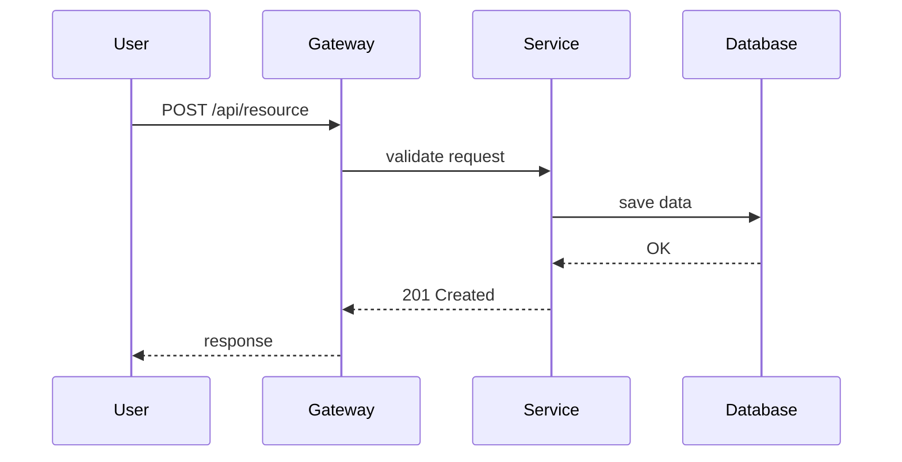
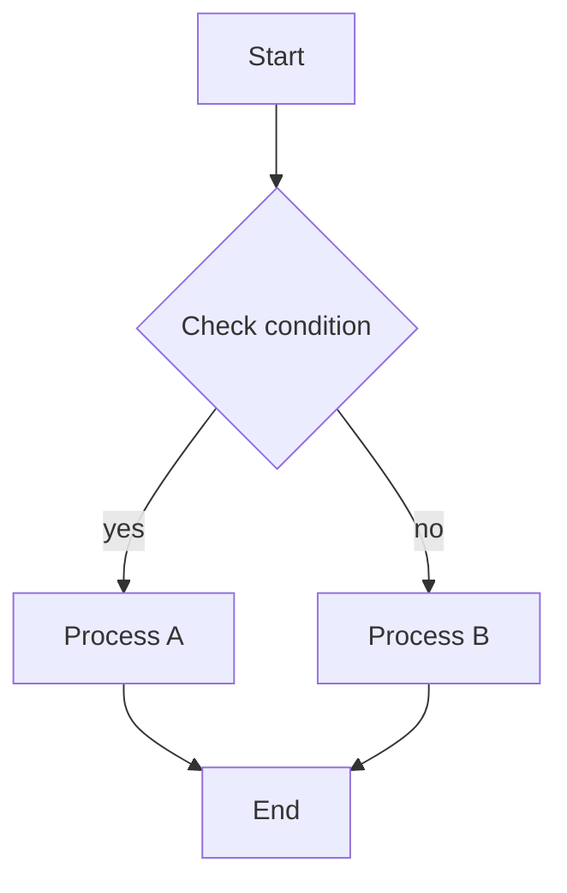
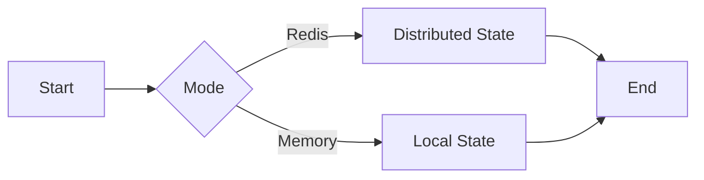
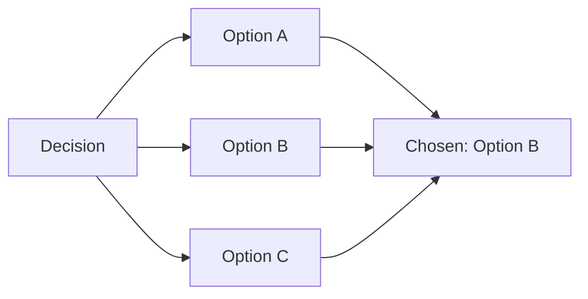
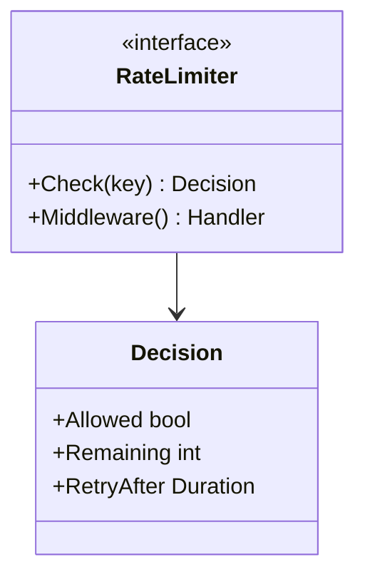
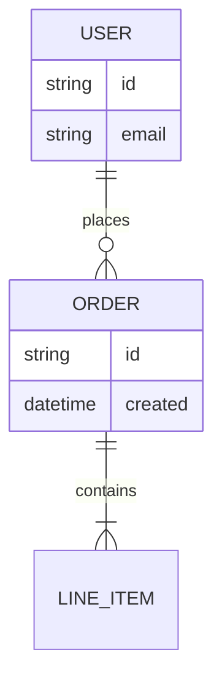
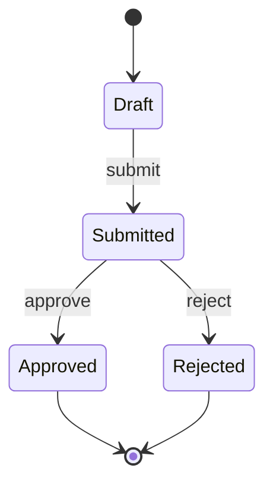

# Mermaid Diagrams Generator from Technical Documents

Generates self-contained Markdown documents with high-quality Mermaid diagrams based on one or more technical documents (FDDs, PRDs, HLDs, RFCs, ADRs, design docs, specs, engineering memos, architecture notes) provided by the user in the chat. One .md file is produced per input document, containing all relevant diagrams embedded as `mermaid` code blocks, ready for download.

## When this skill runs

The user pastes or attaches one or more technical documents in the chat and asks for Mermaid diagrams. Any structured technical document is accepted as input: FDD, PRD, HLD, RFC, ADR, design doc, spec, engineering memo, architecture notes, or similar. The user MAY name a specific document to focus on. There is NO interactive interview with the user. All reasoning, document-type detection, language detection, significance filtering, diagram selection, and consistency review are internal. The AI assumes the role of a Technical Diagram Specialist responsible for translating the input documents into clear, accurate visual representations.

## Core workflow

1. Read every document provided in the chat end to end. If any document was attached as a file, read it with the appropriate tool before starting.
2. Internally classify each document by archetype to guide diagram selection. The archetype influences what to emphasize but NEVER blocks generation:
   - **Structural** (HLD, architecture notes, system overview): emphasize component boundaries, integration points, cross-cutting flows, deployment topology.
   - **Feature-level** (FDD, feature spec, detailed design): emphasize end-to-end feature flow, algorithm logic, public contracts, behavior variations.
   - **Decision-oriented** (ADR, RFC, technical proposal): emphasize the decision space (alternatives compared), the chosen approach, consequences, and any new flows the decision introduces.
   - **Product-oriented** (PRD): emphasize user-visible flows, states, and entities; avoid inventing implementation that the PRD does not describe.
   - **Hybrid**: pick the archetype that fits the dominant content; if multiple apply, blend them.
3. Determine how many diagram documents to produce:
   - If the user named a specific document (ex: "gera os diagramas só do HLD de pagamentos"), produce diagrams ONLY for that document.
   - Otherwise, produce one diagrams document per input document. If a single document was provided, produce a single document.
4. For EACH input document, execute the nine internal phases in the "Operational phases" section below silently. Do NOT show internal reasoning, document-type detection, language detection, significance analysis, pruning logic, or review notes to the user.
5. For each input document, generate ONE standalone Markdown file containing every diagram embedded as `mermaid` code blocks, saved at `./docs/DIAGRAMS-NN-<nome-curto>.md`, where `NN` is a zero-padded sequential number starting at `01`, and `<nome-curto>` is a short kebab-case name derived from the document's title or main subject (ex: `DIAGRAMS-01-rate-limiter.md`, `DIAGRAMS-02-payment-gateway.md`, `DIAGRAMS-03-adr-postgres-vs-dynamo.md`).
6. Call `present_files` with ALL generated paths in order (DIAGRAMS-01 first, DIAGRAMS-02 second, etc.) so the user can download them.
7. End with a brief 3-5 sentence summary in the chat stating how many diagram documents were generated, which input document each one covers, the detected language of each document, and the total number of diagrams produced. Do NOT output the diagram content inline in chat (the files are the deliverable). Do NOT output JSON.

## Scope rules

- Input is one or more technical documents pasted or attached in the chat. Any structured technical document is accepted (FDD, PRD, HLD, RFC, ADR, design doc, spec, engineering memo, architecture notes). If the input is clearly NOT a technical document (a random essay, an email thread without technical content, an isolated code snippet without surrounding context, marketing copy), respond with a short message asking the user to provide a technical document. Otherwise, proceed without questioning the format.
- If the user named a specific document alongside the others, ONLY that document is diagrammed. Other documents present in the chat are ignored for this run.
- ONE output `.md` file per input document. Never merge multiple documents into a single output.
- Each output file is self-contained: all diagrams embedded as `mermaid` code blocks inside the same `.md`. Do NOT generate separate `.mmd` files.
- Do NOT ask clarifying questions before generating. The input document is the source of truth.
- Do NOT fabricate elements not present in the document. If information is insufficient for a meaningful diagram, skip that diagram rather than inventing.

## Absolute rules (always enforced)

1. **No fabrication**: never invent elements not in the input document. Generate ONLY diagrams with sufficient information in the source.
2. **Language matching**: generate the document and diagrams in the SAME language as the input, with PROPER accents and special characters. Keep technical terms in English (Service, Gateway, Redis, Kafka, API, REST, etc.).
3. **Relevance over quantity**: better 6 highly relevant diagrams than 10 with noise. Typical range is 6 to 8 diagrams per document. Maximum is 10, but only if each truly adds significant value. Minimum is 1.
4. **Multiple diagrams of same type allowed**: multiple sequence diagrams (or multiple flowcharts, etc.) are allowed if each serves a different significant purpose.
5. **Significance first**: deep analysis of what truly matters before generating any diagram.
6. **Zero invention**: only elements present or DIRECTLY implied in the source document.
7. **Short labels**: maximum 3 words per node, with proper accents when the source language is not English.
8. **Clean syntax**: each Mermaid command on its own line.
9. **No emojis**: never use emojis in code, documentation, or diagrams.
10. **Single file per document**: generate ONE `.md` per input document. Do not create separate `.mmd` files. All diagrams are embedded as `mermaid` code blocks inside the same file.
11. **Clean document structure**: the document contains ONLY these sections (translated to the source language): Overview, Identified Elements, Diagrams (each with Title, Description, Code, Notes). Do NOT include Analysis, Rationale, Design Decisions, or Consistency Guarantees sections at the end.
12. **Mandatory internal review**: after generating content, re-read the source document and the output, identify and correct ALL inconsistencies before writing the final file.

## Operational phases (all silent, internal)

### Phase 1: Source document deep analysis

Invest time here. This is the most critical phase.

1. Read the complete document end to end. Understand the system's purpose and scope. Note the document's title or main subject for file naming.
2. Classify the archetype internally (structural, feature-level, decision-oriented, product-oriented, hybrid). The archetype guides what to emphasize, not whether to proceed.
3. Detect the source language (usually Portuguese or English). All output text MUST be in the detected language with proper accents and special characters. Technical terms remain in English.
4. Extract explicit elements (only those that apply to the document at hand):
   - External actors and systems (users, services, APIs, third parties).
   - Input and output channels (HTTP endpoints, events, queues, CLI commands, file formats).
   - Internal components, subsystems, and their boundaries (relevant especially for structural documents).
   - Internal processes with clear steps (algorithms, workflows, pipelines, batch stages).
   - State transitions and lifecycles (orders, jobs, sessions, sagas, document statuses).
   - Conditional decisions (modes, feature flags, strategies, alternative paths).
   - Public contracts (interfaces, data structures, message formats, schemas).
   - Technologies and dependencies (languages, frameworks, databases, infrastructure).
   - Error handling and fallback mechanisms.
   - Configuration modes and alternatives.
   - For decision documents (ADR/RFC): the alternatives considered, the chosen option, and the consequences.
5. Identify what is central to the document's purpose: main flow (happy path), critical algorithms, key architectural decisions, integration points, failure modes, decision rationale (for ADR/RFC).
6. Mark exclusions: items the document marks as out of scope, excluded, deferred, non-goals, future work, won't-do, or similar phrases. These must NEVER appear in any diagram.
7. For any element that might require inference, note which section supports it. Minimize inferences; prefer explicit elements only.

### Phase 2: Significance evaluation (the filtering phase)

For each potential diagram candidate, rigorously ask:

1. Does it explain the end-to-end main flow or main interaction?
2. Does it clarify a difficult or non-obvious part? (algorithm with conditional logic, state transitions, fallback/retry, concurrent coordination, multi-component orchestration)
3. Does it illustrate an important architectural decision or trade-off? (operating modes, strategy selection, storage backends, degradation patterns, alternatives compared in an ADR/RFC)
4. Does it show essential public contracts for integrations? (interfaces, payloads, event formats, schemas)
5. Does it visualize relationships between entities, components, or subsystems?
6. Does it map a lifecycle or state machine that is central to the document?
   **Decision rule**: if the answer is YES to at least ONE question AND the diagram would significantly reduce ambiguity or cognitive load, the diagram is eligible. Otherwise, skip it. Also skip if it would be redundant with another candidate.

### Phase 3: Diagram type selection

Choose the type that best communicates the significant element:

- **Sequence diagram**: clear interaction timeline between external and internal participants. Best for API calls, event flows, request-response patterns, temporal ordering, cross-component orchestration.
- **Flowchart TD (top-down)**: internal process logic, algorithms, sequential steps. Best for decision trees, algorithm flow, step-by-step processes, pipeline stages, batch jobs.
- **Flowchart LR (left-right)**: to compare alternative paths by mode/config flag, or to lay out subsystem boundaries side by side. Best for mode comparison (Redis vs Memory), strategy selection, parallel alternatives, ADR option comparison, structural component layouts.
- **Class diagram**: exposed contracts, interfaces, types. Best for public APIs, data structures, type relationships, interface hierarchies, library SDK surfaces.
- **ER diagram**: when the document describes relationships between entities or messages. Best for data models, entity relationships, message schemas, database design.
- **State diagram (stateDiagram-v2)**: lifecycles and state machines. Best for order/job/session statuses, sagas, document workflows, async process states.
  Quick document-to-diagram mapping (cross-archetype):

- Document mentions endpoints/events and external actors → Sequence.
- Document describes a request/response or event-driven orchestration across components → Sequence.
- Document details an algorithm or internal step-by-step logic → Flowchart TD.
- Document describes a batch pipeline with stages → Flowchart TD or LR depending on layout.
- Document describes a data pipeline (ingest → transform → store) → Flowchart LR.
- Document describes modes, flags, fallback, alternative strategies → Flowchart LR.
- Document compares architectural alternatives (typical in ADR/RFC) → Flowchart LR with one branch per alternative.
- Document publishes interfaces, structs, external messages → Class.
- Document defines stable relationships between entities/messages → ER.
- Document describes a lifecycle, status flow, saga, or workflow with discrete states → State diagram.
- Structural document describes subsystems and their boundaries → Flowchart TD or LR with subgraphs as boundaries.
- Decision document (ADR/RFC) → one Flowchart LR comparing alternatives, plus diagrams of the chosen approach as needed.

### Phase 4: Pruning and optimization

Limits:

- Maximum 10 diagrams per document (hard limit, only if truly needed).
- Minimum 1 diagram.
- Typical range: 6 to 8 diagrams.
- Multiple diagrams of the same type are allowed if each serves a different purpose.
  Rules:
- Never two diagrams saying the same thing.
- If a flow has more than 8 steps, group into 5 or fewer logical nodes without losing meaning.
- If a diagram becomes dense (more than 10 nodes), consider splitting into two complementary views.
- Remove redundancy aggressively.
  Prioritization (when there are more candidates than slots):

1. Main flow or main interaction (almost always include).
2. Most complex or ambiguous algorithm or decision logic.
3. Key architectural variation (modes, strategies, fallback) OR, for decision documents, the alternatives comparison.
4. Critical public contract (if the document is about a library, API, or integration surface).
5. Central lifecycle or state machine (if the document defines one).
6. Error handling or resilience pattern (if non-trivial).

### Phase 5: Label and name preparation

Naming patterns:

- External systems: External, Gateway, Client, User, ThirdParty.
- Internal components: Service, Worker, Handler, Manager, Controller, Orchestrator.
- Storage: Store, Cache, Database, Queue, Repository, Topic.
- Infrastructure: Collector, Logger, Tracer, Monitor, Scheduler.
- Pipelines: Ingest, Transform, Enrich, Aggregate, Sink.
  Arrow abbreviations: OK, NO, YES, ERR, ERROR, RETRY, TIMEOUT, RA (retry-after), CFG (config), AUTH (authentication).

Label rules:

- Maximum 3 words per node label.
- Use proper accents and special characters inside node labels when the source language requires them (Mermaid supports UTF-8).
- Keep technical terms in English.

### Phase 6: Document generation

Create ONE Markdown file per input document, saved at `./docs/DIAGRAMS-NN-<nome-curto>.md`. All diagrams are embedded as `mermaid` code blocks inside this single file.

**Language adaptation**: the template below is shown in English for clarity. Translate ALL section headers and labels to match the source document's language, with proper accents. Keep technical terms in English.

**Adaptive subsections**: under "Identified Elements", include only subsections that have real content from the source. Omit empty ones. You MAY add other subsections when the archetype calls for them (for example, "Components and Boundaries" for structural documents, or "Decisions and Alternatives" for ADR/RFC).

Document structure (adapt to source language and archetype):

````markdown
# Mermaid Diagrams - [Subject Name]

## Overview

[Explain the document's subject and scope in 2-4 sentences based on the source. Use proper accents for the source language.]

## Identified Elements

### External Flows

- [List elements found in the source, if applicable]

### Internal Processes

- [List elements found in the source, if applicable]

### Behavior Variations

- [List modes, flags, strategies found in the source, if applicable]

### Public Contracts

- [List interfaces, types, messages found in the source, if applicable]

### Components and Boundaries

- [Only if the source is structural and describes subsystems/boundaries]

### Decisions and Alternatives

- [Only if the source is an ADR/RFC and compares alternatives]

## Diagrams

### [Diagram 1 title, e.g., "Main Flow" or "Fluxo Principal"]

[Concise paragraph of 3-5 sentences describing what the diagram represents, when it should be used, and why it is relevant to understanding the system. Do NOT include the diagram type in the title (not "Sequence Diagram - Main Flow", just "Main Flow"). Use proper accents for the source language.]

```mermaid
[diagram code]
```

**Notes**

- [Explanation point 1]
- [Explanation point 2]

---

[Repeat for each diagram, typically 6 to 8, up to 10 only if truly justified]
````

Translation examples:

- Portuguese: "Mermaid Diagrams" → "Diagramas Mermaid"; "Overview" → "Visão Geral"; "Identified Elements" → "Elementos Identificados"; "External Flows" → "Fluxos externos"; "Internal Processes" → "Processos internos"; "Behavior Variations" → "Variações de comportamento"; "Public Contracts" → "Contratos públicos"; "Components and Boundaries" → "Componentes e Fronteiras"; "Decisions and Alternatives" → "Decisões e Alternativas"; "Diagrams" → "Diagramas"; "Notes" → "Notas".
- English: keep all headers as shown above.

### Phase 7: Mermaid code quality guidelines

General rules:

- Each Mermaid statement on its own line.
- Use clear hierarchical indentation.
- Validate common patterns before writing.
  Hard guardrails to avoid parse errors:
- Do NOT use `\n` inside labels. For line breaks inside a single label, use `<br/>`.
- Do NOT put accents, symbols, or spaces in IDs of nodes, states, or subgraphs. Use ASCII for IDs (`Operacao`, `nao`, `delta_t`). Keep accents in LABELS normally.
- Do NOT leave subgraph titles unquoted when they contain spaces, accents, or parentheses. Prefer `subgraph "Modo Redis (estado compartilhado)"`.
- Do NOT use parentheses or spaces in participant display names without quotes. Prefer `participant R as "Redis (Lua)"`.
- Do NOT split a single node label into two bracket blocks (`[...][...]`). Use one block with `<br/>` if you need two lines.
- Do NOT nest markdown or code formatting inside labels.
- Do NOT mix arrow types: sequence uses `->>`, `-->>`, `--x`; flowcharts use `-->`, `-.->`, and `-- text -->`; state diagrams use `-->`.
- Do NOT use non-ASCII symbols in state identifiers (`state Operação { ... }` is invalid; use `Operacao` as ID and keep accents in notes/labels).
- Do NOT include `;` or `:` inside node IDs. Colons are allowed in edge text only (`A -->|nao| B`).
- Do NOT forget to close the code fence. Every `mermaid` block must close with the matching triple-backtick on a new line.
- Do NOT use complex expressions or code syntax in node labels (they break parsing):
  - Avoid function calls: `min(`, `max(`, `sum(`, `count(` → use "Apply limit", "Calculate total".
  - Avoid increment/decrement: `++`, `--` → use "Increment counter", "Decrement value".
  - Avoid complex operators: `+=`, `-=`, `*=`, `/=` → use "Add to total", "Update value".
  - Avoid metric syntax: `{.*}++` or `identifier{` → use "Increment metric".
  - Example fixes: `[count++]` → `[Increment count]`; `[tokens = min(burst, tokens + rate)]` → `[Recalculate tokens]`; `[remaining = limit - count]` → `[Update remaining]`.
  - Keep labels simple and descriptive; put technical details in the Notes section below the diagram.
    **Pre-write syntax validation**: before writing the file, validate ALL diagrams. Extract every node label, search for problematic patterns listed above, rewrite any offending label to be simple and descriptive, and move technical details to the Notes section. Re-validate until all diagrams are clean.

Safe templates:

Sequence diagram:



Flowchart TD:



Flowchart LR (mode comparison):



Flowchart LR (ADR alternatives):



Class diagram:



ER diagram:



State diagram (lifecycle):



### Phase 8: Internal review and consistency correction (mandatory)

After generating the complete document but BEFORE writing the file, perform an internal review. This review is silent and is the quality gate before delivery.

Steps:

1. Re-read the source document completely. Refresh understanding of every section, explicit information, and requirement. Verify excluded items.
2. Re-read the generated document completely. Examine every diagram, title, description, and note. Check language and accents.
3. Create an internal inconsistency list. Compare output against source and identify:
   - Missing elements required by the source but absent in diagrams.
   - Fabricated elements present in diagrams but NOT in the source.
   - Wrong technologies (names, versions, specs that do not match the source).
   - Wrong relationships that contradict the source.
   - Missing accents anywhere (titles, descriptions, AND node labels).
   - Technical terms translated when they should remain in English.
   - Syntax errors or problematic patterns in node labels.
   - Diagrams that fail the significance criteria.
   - Redundancy between diagrams.
   - Excluded items present in diagrams.
   - Language mismatch between output and source.
   - Unwanted sections (Analysis, Rationale, Design Decisions, Consistency Guarantees).
4. Correct ALL inconsistencies in the draft before writing the final file:
   - Remove fabricated information.
   - Add missing significant source elements.
   - Fix technology names and versions.
   - Ensure proper accents throughout.
   - Remove or merge redundant diagrams.
   - Verify no excluded items remain.
5. Verify corrections. Confirm all inconsistencies are resolved. Ensure diagram count is between 1 and 10. Verify language and accents throughout.
   This review is internal. Do NOT expose it in the final document.

### Phase 9: Validation checklist

Before writing each file:

- [ ] Source language detected and output matches that language.
- [ ] All accents and special characters correct EVERYWHERE (markdown text AND diagram node labels).
- [ ] Technical terms kept in English.
- [ ] Between 1 and 10 diagrams (typically 6 to 8).
- [ ] Multiple diagrams of the same type are OK if each serves a different purpose.
- [ ] Each diagram meets the significance criteria.
- [ ] No redundancy between diagrams.
- [ ] No fabricated elements.
- [ ] No excluded items present.
- [ ] Short node labels (3 words max).
- [ ] Clean Mermaid syntax (every guardrail from Phase 7 respected).
- [ ] Document structure follows the template: Overview, Identified Elements, Diagrams (with Title, Description, Code, Notes for each).
- [ ] Adaptive subsections under Identified Elements: only those with real content appear; archetype-specific subsections (Components and Boundaries, Decisions and Alternatives) added when applicable.
- [ ] NO source section references inside diagram labels or node text.
- [ ] NO Analysis, Rationale, Design Decisions, or Consistency Guarantees sections at the end.
- [ ] Internal review completed and all inconsistencies corrected.
- [ ] No emojis anywhere.
- [ ] File naming: `./docs/DIAGRAMS-NN-<nome-curto>.md`.

## Style rules

- Match the source language exactly (Portuguese source → Portuguese output; English source → English output).
- Use proper accents and special characters (Portuguese: "Visão Geral", "Análise", "Fluxos", "Variações", "Públicos", never "Visao Geral" or "Variacoes").
- Keep technical terms in English (Service, Gateway, Worker, Store, Queue, Redis, Kafka, Prometheus, Docker, API, REST, GraphQL).
- Do NOT use em dashes `—`. Use commas, "e", or restructure the sentence.
- Do NOT use emojis anywhere.
- Node labels: maximum 3 words, plain text, no code syntax.
- Diagram titles do not include the diagram type (use "Fluxo Principal", not "Diagrama de Sequência - Fluxo Principal").

## Examples

### Example 1: user pastes a single FDD and asks for diagrams

**Input (user turn):** Pastes the full FDD for a rate limiter in Portuguese and says "Gera os diagramas Mermaid desse FDD".

**Correct behavior:**

1. Read the pasted document end to end.
2. Detect archetype: feature-level (FDD). Detect language: Portuguese.
3. Run phases 1 to 5 silently. Identify main flow, algorithm logic, Redis vs Memory mode comparison, public contract, resilience pattern. Select 6 diagrams.
4. Run phase 6 and generate the output in Portuguese with proper accents ("Visão Geral", "Elementos Identificados", "Fluxos externos", etc.).
5. Apply phase 7 guardrails and validate syntax.
6. Run phase 8 internal review and fix any inconsistencies silently.
7. Run phase 9 validation checklist.
8. Save as `./docs/DIAGRAMS-01-rate-limiter.md`.
9. Call `present_files` with the file path.
10. Respond in 3-5 sentences: "Foi gerado 1 documento de diagramas a partir do FDD do rate limiter (idioma detectado: português). O arquivo contém 6 diagramas: fluxo principal, algoritmo de token bucket, comparação entre modos Redis e memória, contrato público, fluxo de fallback e padrão de resiliência. Arquivo disponível para download."

### Example 2: user pastes multiple documents of different types

**Input:** User pastes three documents (an FDD for tokenização de cartão, an HLD for checkout síncrono, an ADR comparing payment gateways) and says "Gera os diagramas desses documentos".

**Correct behavior:**

- Treat each document independently. Detect archetype per document (feature-level, structural, decision-oriented). Produce one diagrams output per document.
- Save as `./docs/DIAGRAMS-01-tokenizacao-cartao.md`, `DIAGRAMS-02-checkout-sincrono.md`, `DIAGRAMS-03-adr-payment-gateway.md`.
- For the FDD, emphasize feature flow, algorithm, and contracts. For the HLD, emphasize components, boundaries, and integration flows. For the ADR, include the alternatives comparison and the chosen approach.
- Call `present_files` with all three paths in order.
- Respond with a short summary listing what each document covers and how many diagrams each one has.

### Example 3: user pastes multiple documents and names one

**Input:** User pastes three documents and says "Gera os diagramas só do HLD de checkout".

**Correct behavior:**

- Generate diagrams ONLY for the checkout HLD. Ignore the other two.
- Save as `./docs/DIAGRAMS-01-checkout-hld.md`.
- Present the single file.
- Chat response confirms that only the checkout HLD was diagrammed and that the others were not covered in this run.

### Example 4: user pastes an English RFC

**Input:** User pastes an RFC in English proposing a new webhook dispatcher and says "Generate Mermaid diagrams for this RFC".

**Correct behavior:**

- Detect archetype: decision-oriented (RFC). Detect language: English.
- Generate the output in English with English headers (Overview, Identified Elements, Decisions and Alternatives, Diagrams, Notes).
- Include a diagram comparing the alternatives discussed in the RFC, plus diagrams of the proposed dispatcher flow and contracts.
- Save as `./docs/DIAGRAMS-01-webhook-dispatcher-rfc.md`.
- Present the file.
- Chat response in English.

### Example 5: user pastes an HLD

**Input:** User pastes an HLD for a multi-tenant analytics platform in Portuguese and says "Diagrama esse HLD".

**Correct behavior:**

- Detect archetype: structural (HLD). Detect language: Portuguese.
- Emphasize components and boundaries, integration flows between subsystems, deployment topology if described, and key cross-cutting flows. Include the "Componentes e Fronteiras" subsection under "Elementos Identificados".
- Typically produce diagrams like: macro architecture (flowchart LR with subgraphs per boundary), main data ingestion flow (sequence or flowchart TD), query path (sequence), tenant isolation strategy (flowchart LR comparing modes), and key public contracts (class) if exposed.
- Save as `./docs/DIAGRAMS-01-plataforma-analytics.md`.
- Present the file and respond in Portuguese.

### Example 6: user pastes an ADR

**Input:** User pastes an ADR titled "ADR-014: Postgres vs DynamoDB para armazenamento de eventos" and says "Gera os diagramas Mermaid desse ADR".

**Correct behavior:**

- Detect archetype: decision-oriented (ADR). Detect language: Portuguese.
- Always include a diagram comparing the alternatives (Flowchart LR with one branch per option, converging on the chosen one). Include a diagram of the chosen approach in operation (sequence or flowchart TD) if the ADR describes it. Include a class or ER diagram if the ADR specifies the resulting data model.
- Include the "Decisões e Alternativas" subsection under "Elementos Identificados", listing the options considered and the consequences.
- Save as `./docs/DIAGRAMS-01-adr-014-postgres-vs-dynamo.md`.
- Present the file and respond in Portuguese.

### Example 7: user pastes content that is clearly not a technical document

**Input:** User pastes a marketing one-pager, a casual email thread without technical content, an isolated code snippet with no surrounding context, or a personal essay, and says "Gera os diagramas disso".

**Correct behavior:**

- Do NOT generate diagrams.
- Respond with a short message explaining that the skill requires a technical document as input (FDD, PRD, HLD, RFC, ADR, design doc, spec, engineering memo, architecture notes) and ask the user to provide one. Be brief and non-judgmental.
  **Incorrect behavior (do NOT do this in any example):**
- Asking the user which diagrams to generate, which types to use, or which parts of the document to focus on. Everything is decided internally using the significance filter.
- Holding an interview with the user.
- Rejecting a document just because it is not an FDD. As long as it is a technical document, proceed.
- Generating more than 10 diagrams, or producing low-value diagrams that do not pass the significance filter.
- Fabricating elements that are not in the source.
- Including excluded items or out-of-scope items from the source in any diagram.
- Producing the output inline in chat instead of as `.md` files.
- Creating separate `.mmd` files, or splitting one input document across multiple `.md` files.
- Merging multiple input documents into a single `.md` file.
- Using em dashes `—`.
- Using emojis anywhere.
- Translating technical terms into the source language (Service, Gateway, Redis, etc. must stay in English).
- Adding Analysis, Rationale, Design Decisions, or Consistency Guarantees sections at the end of the document.
- Including the diagram type inside the diagram title (use "Main Flow", not "Sequence Diagram - Main Flow").

## Final checks before responding

- All files exist in `./docs/` with correct `DIAGRAMS-NN-<nome-curto>.md` naming.
- Enumeration is sequential and zero-padded, starting at `DIAGRAMS-01`.
- Each file is a complete standalone document following the template exactly, with adaptive subsections per archetype.
- Each file contains between 1 and 10 Mermaid diagrams (typically 6 to 8), each passing the significance filter.
- Each diagram has a title (without diagram type), a 3-5 sentence description, a `mermaid` code block, and a Notes section.
- All node labels are 3 words or fewer, use proper accents for the source language, and keep technical terms in English.
- No fabricated elements. No excluded items. No emojis. No em dashes `—`.
- No Analysis, Rationale, Design Decisions, or Consistency Guarantees sections at the end.
- `present_files` was called with all generated paths in order.
- The chat response is short (3-5 sentences), lists how many documents were generated, which input document each one covers, the detected language, and points to the files.
- If the user named a specific document, only that one was diagrammed and the response explicitly confirms that the others were not covered in this run.
