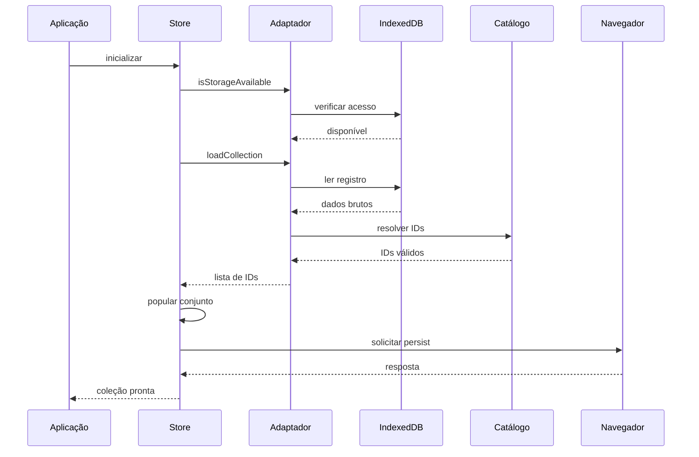
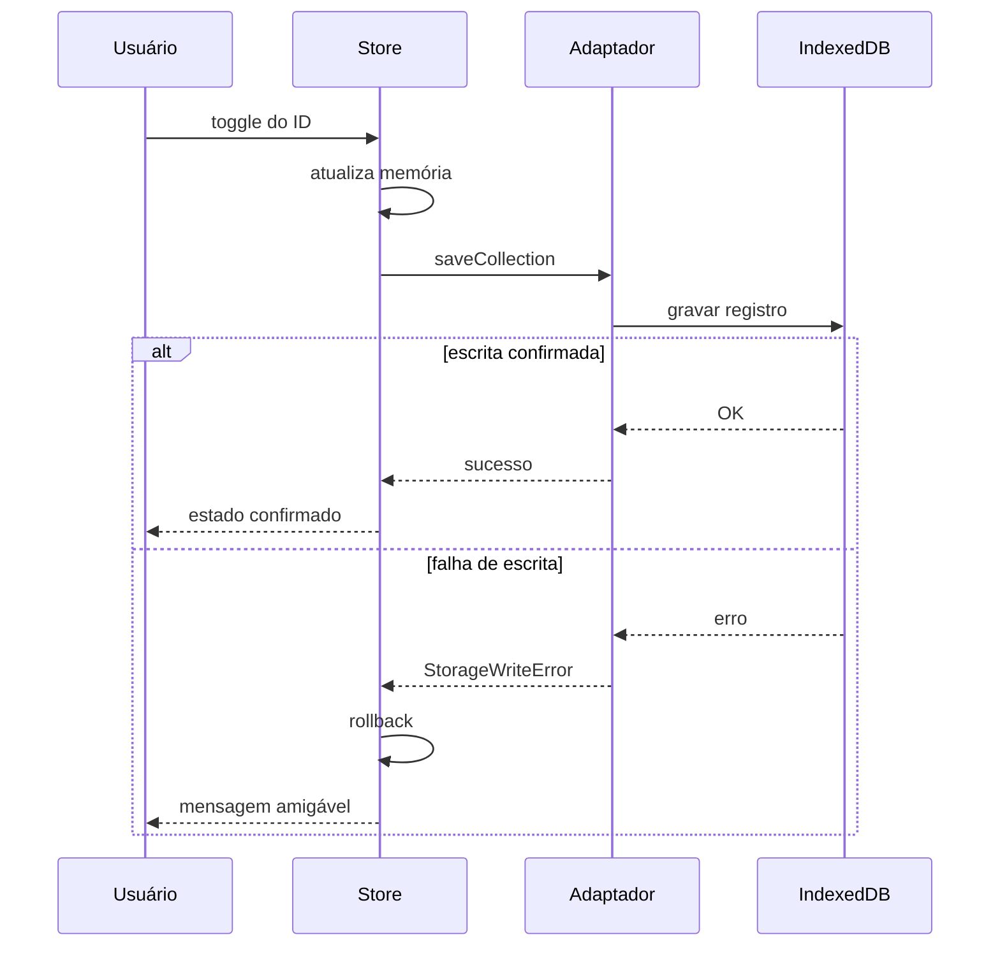
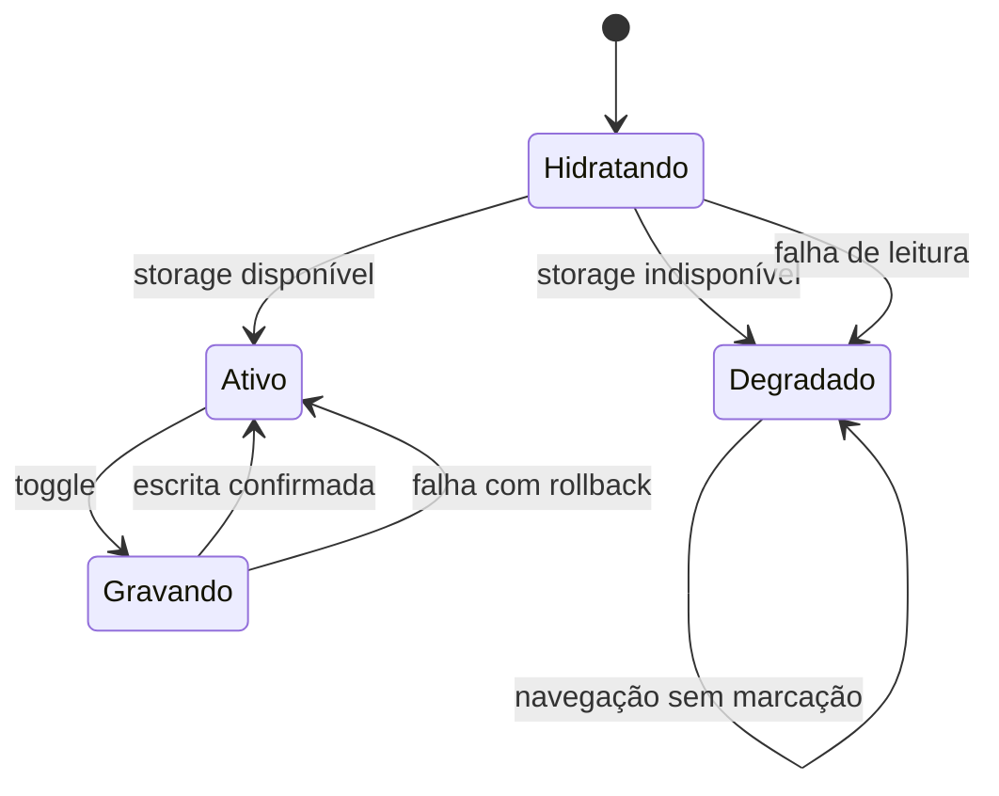
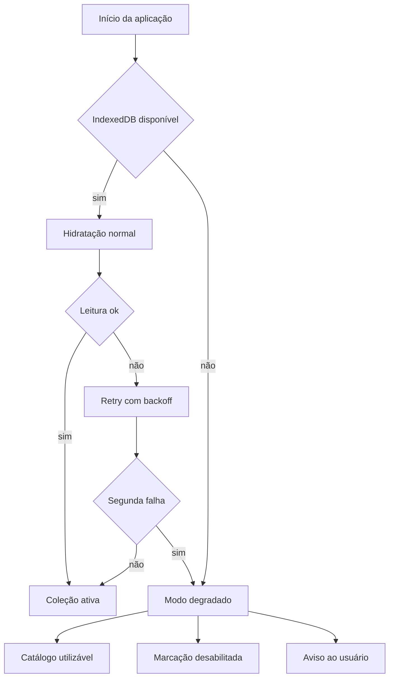
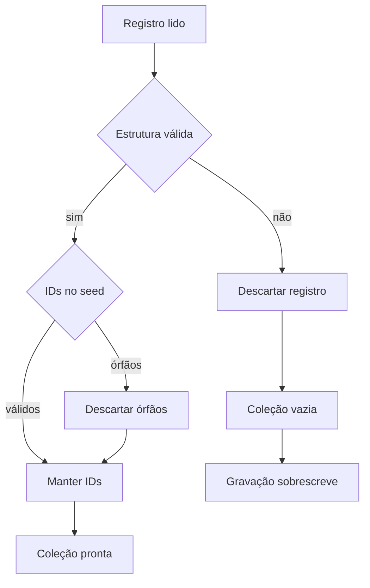
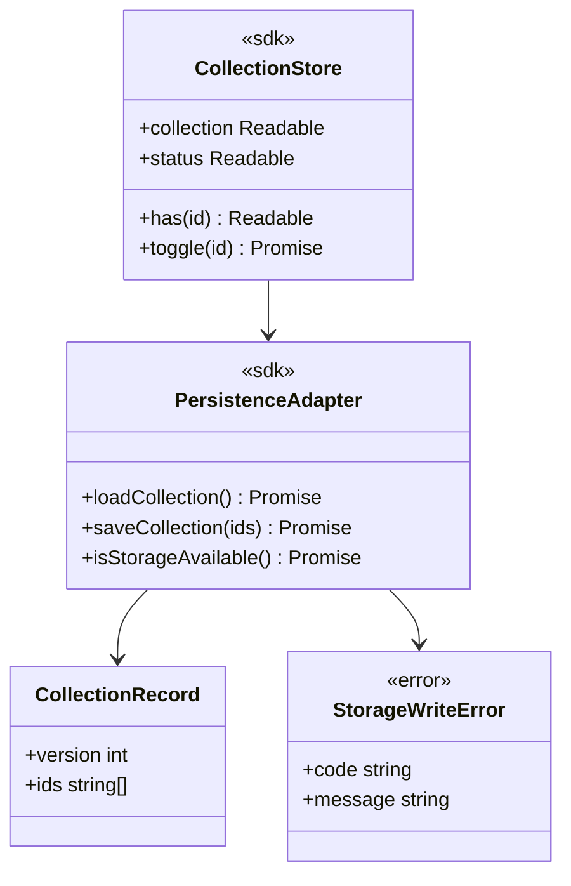

# Diagramas Mermaid - Persistência da Coleção no IndexedDB

## Visão Geral

Esta feature implementa a Store da coleção e o Adaptador de persistência sobre `idb-keyval`, gravando apenas IDs de elementais no IndexedDB do navegador, sem backend e sem autenticação. Ela cobre a hidratação na inicialização, o toggle com confirmação de escrita, o descarte de IDs órfãos e a degradação graciosa quando o storage está indisponível. Os diagramas abaixo representam os fluxos, os estados, as variações de comportamento e os contratos públicos descritos no FDD-01.

## Elementos Identificados

### Fluxos externos

- Usuário no navegador, desktop e móvel, acionando o toggle de coleção
- IndexedDB do navegador como destino das leituras e gravações via `idb-keyval`
- API `navigator.storage.persist()` para persistência elevada de storage

### Processos internos

- Hidratação da coleção na inicialização, com leitura, validação e resolução contra o catálogo
- Toggle de coleção com atualização em memória, gravação confirmada e rollback em falha
- Validação da estrutura do registro e descarte de IDs órfãos e de registros corrompidos
- Detecção de indisponibilidade do IndexedDB e ativação do modo degradado
- Retry único de leitura com backoff exponencial e jitter, base de 200 ms

### Variações de comportamento

- Modo ativo: leitura e escrita confirmadas no IndexedDB
- Modo degradado: catálogo utilizável, marcação desabilitada e aviso ao usuário
- Falha de escrita: rollback do estado em memória e mensagem explícita
- Registro corrompido: descarte do registro e coleção iniciada vazia

### Contratos públicos

- Adaptador de persistência: `loadCollection`, `saveCollection`, `isStorageAvailable`
- Store da coleção: `collection`, `has`, `toggle`, `status`
- Registro persistido versionado pelo campo `version`, com lista de IDs
- Erro tipado `StorageWriteError` em falha de gravação

## Diagramas

### Hidratação na Inicialização

Este diagrama mostra a sequência completa de hidratação da coleção quando a aplicação inicializa. A Store solicita a leitura ao adaptador, que verifica a disponibilidade do IndexedDB, lê o registro da chave `collection` e resolve os IDs contra o catálogo, descartando órfãos. Ao final, a Store popula o conjunto reativo e solicita persistência elevada de storage ao navegador. É o fluxo de entrada de todos os estados posteriores da feature.

**Notas**

- IDs lidos que não existem no seed atual são descartados na resolução, sem erro visível.
- Em falha de leitura, há 1 nova tentativa automática com backoff exponencial e jitter, base de 200 ms.
- `loadCollection` nunca rejeita por registro ausente, retornando lista vazia.
- Timeout de 2 segundos por operação de storage evita travamento da inicialização.

---

### Toggle com Confirmação de Escrita

Este diagrama representa o fluxo de marcação e desmarcação de um elemental pelo usuário. A Store atualiza o conjunto em memória e comanda a gravação no IndexedDB. Em sucesso, o estado visual é confirmado; em falha, a Store reverte o conjunto ao estado anterior e o usuário recebe mensagem amigável. Ele materializa a invariante de que o estado visual nunca diverge do conteúdo confirmado no storage.

**Notas**

- Escrita sem retry automático; o usuário repete a ação após a mensagem de erro.
- Toggles concorrentes são serializados, uma gravação por vez.
- `toggle` rejeita em até 2 segundos quando a escrita falha, após o rollback.

---

### Ciclo de Estados da Store

Este diagrama consolida os estados possíveis da Store da coleção e as transições entre eles. A inicialização passa por Hidratando e converge para Ativo ou Degradado conforme a disponibilidade do storage e o resultado da leitura. Cada toggle leva ao estado Gravando, que retorna a Ativo tanto em confirmação quanto em falha com rollback. É a referência central para entender o comportamento reativo da feature.

**Notas**

- O modo degradado persiste até o próximo carregamento da aplicação.
- Em Degradado, o catálogo segue utilizável e a marcação fica desabilitada, com aviso claro.
- Falhas consecutivas de storage mantêm a feature degradada, substituindo circuit breaker.

---

### Detecção do Modo Degradado

Este diagrama detalha a lógica de decisão que leva a feature ao modo degradado durante a inicialização. Ele cobre os dois gatilhos principais: IndexedDB bloqueado ou ausente, e falha de leitura persistente após a tentativa automática. O resultado é sempre uma aplicação navegável, com catálogo completo, marcação desabilitada e aviso explícito ao usuário. Nenhuma falha de storage quebra a navegação.

**Notas**

- O gatilho de indisponibilidade ocorre na verificação inicial de acesso ao IndexedDB.
- O retry de leitura usa backoff exponencial com jitter, base de 200 ms, uma única nova tentativa.
- O contador `storage.degraded_mode.activations` registra o motivo: blocked, read_error ou unavailable.

---

### Tratamento do Registro Persistido

Este diagrama mostra como o registro lido do IndexedDB é validado antes de compor a coleção. Registros com estrutura inválida, ou seja, conteúdo que não é uma lista de strings versionada, são descartados e a coleção inicia vazia. IDs válidos em estrutura correta, mas ausentes no seed atual, são descartados individualmente como órfãos. A próxima gravação válida sobrescreve o registro, reconstruindo-o automaticamente.

**Notas**

- A validação exige lista de strings com campo `version`; versão inicial é `1`.
- O descarte de órfãos não gera erro visível e não trava a hidratação.
- Leituras de versões antigas do registro são migradas ou descartadas sem erro.

---

### Contratos Públicos

Este diagrama apresenta os contratos expostos pela feature e suas relações. O Adaptador de persistência encapsula as operações de storage e o formato do registro versionado, enquanto a Store da coleção expõe a superfície reativa consumida pelas telas. O erro tipado `StorageWriteError` sinaliza falhas de gravação para o tratamento de rollback. Serve como referência rápida para os consumidores da camada de persistência.

**Notas**

- O registro usa chave única `collection`, com até 117 IDs e payload abaixo de 4 KB.
- `status` emite `active` ou `degraded`, habilitando o aviso na interface.
- O contrato da Store permanece estável dentro da major version da aplicação.
