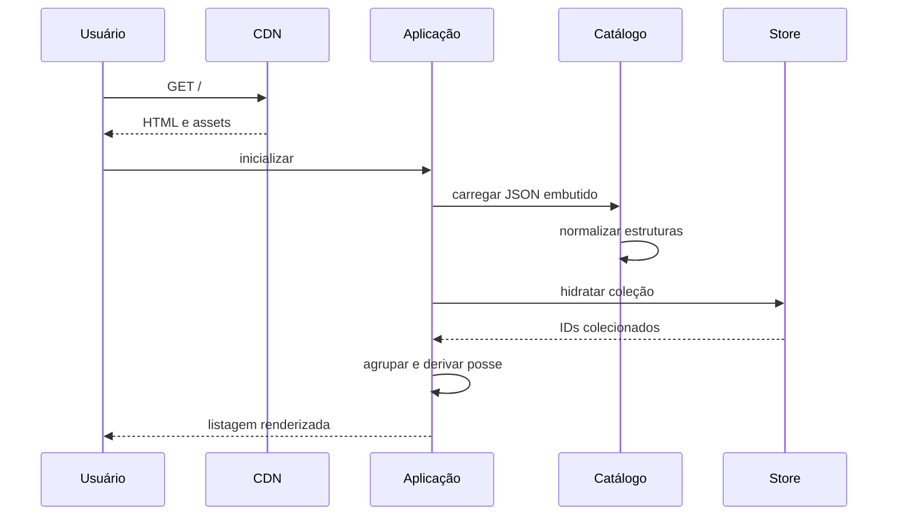
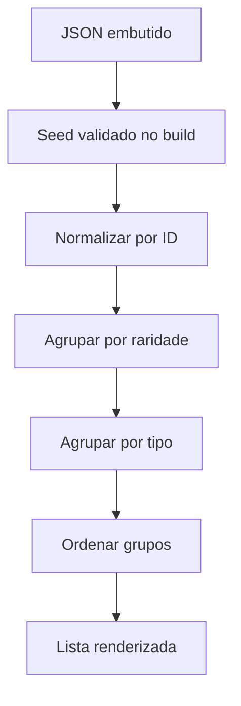
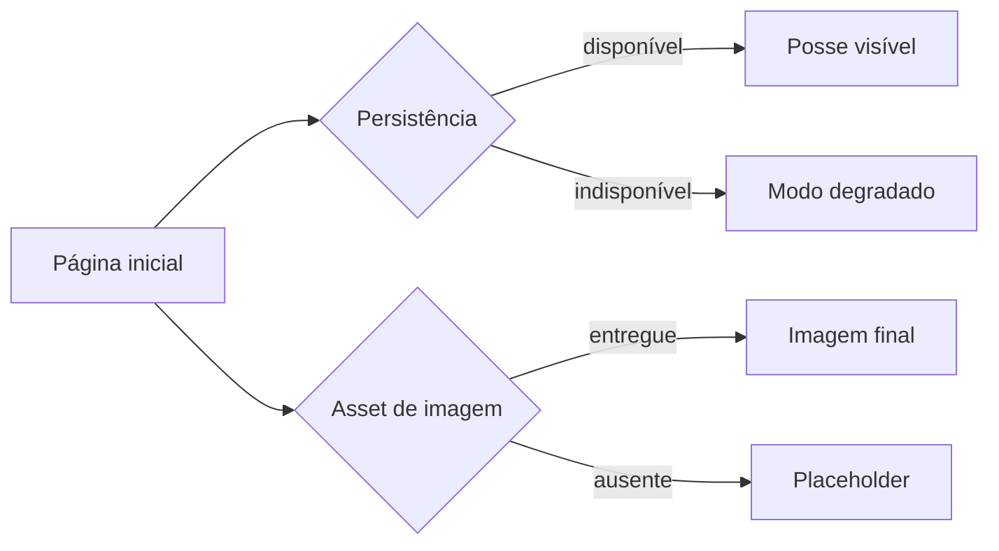
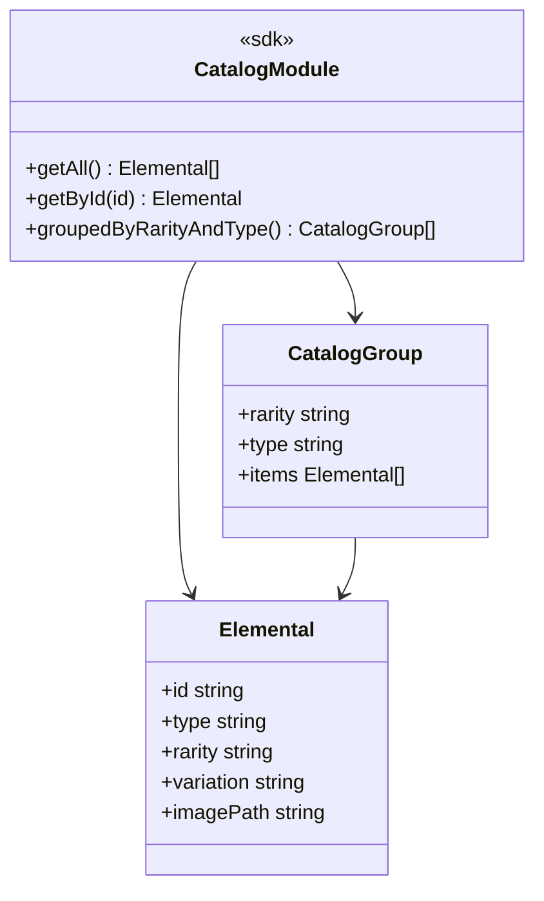
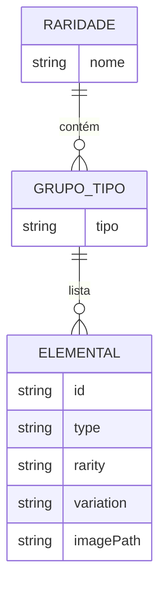
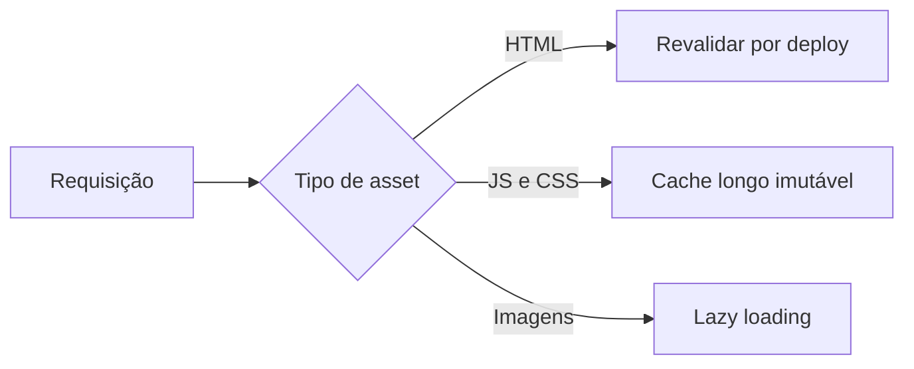

# Diagramas Mermaid - Listagem do Catálogo na Página Inicial

## Visão Geral

A página inicial renderiza o catálogo completo de 117 elementais, agrupado por raridade e, dentro dela, por tipo, com indicação de posse por item e aviso permanente sobre persistência local. A entrega é 100 por cento estática via CDN, sem nenhuma chamada de rede a backend, usando o módulo de catálogo read-only embutido no build e a Store da coleção para o estado de posse. Os diagramas abaixo cobrem o fluxo de carregamento, o agrupamento determinístico, as variações de renderização, os contratos e a política de cache descritos no FDD-02.

## Elementos Identificados

### Fluxos externos

- Usuário no navegador, desktop e móvel, acessando a página inicial
- CDN do provedor de hosting entregando HTML, CSS e JS estáticos com cache de edge
- Navegação para a tela individual ao selecionar um item

### Processos internos

- Normalização do catálogo embutido em estruturas de consulta por raridade, tipo e ID
- Agrupamento por raridade e, dentro dela, por tipo, com ordem determinística
- Derivação do estado de posse por item a partir da Store da coleção
- Fallback de imagem para placeholder por tipo e variação
- Lazy loading das imagens WebP

### Variações de comportamento

- Modo normal: listagem completa com indicação de posse em tempo real
- Modo degradado: listagem completa sem indicação de posse, com aviso de persistência indisponível
- Imagem ausente: placeholder correspondente ao tipo e variação, sem impacto funcional
- Carregamento lento: estado de carregamento até a entrega do bundle

### Contratos públicos

- Página inicial: `GET /`, HTML pré-renderizado com revalidação a cada deploy
- Módulo de catálogo: `getAll`, `getById`, `groupedByRarityAndType`
- Tipo `Elemental` com id, type, rarity, variation e imagePath

## Diagramas

### Fluxo Principal de Carregamento

Este diagrama mostra a sequência de carregamento da página inicial, da requisição ao CDN até a renderização da listagem. O bundle estático é entregue com cache de edge, o módulo de catálogo carrega o JSON embutido sem rede, normaliza as estruturas de consulta e a Store da coleção é hidratada em paralelo à composição da página. A interface então deriva agrupamento e posse, renderizando os grupos em ordem determinística. É o fluxo que sustenta as metas de 200 ms de carregamento e 150 KB de bundle inicial.

**Notas**

- Nenhuma chamada de rede é feita para obter o catálogo em runtime; o JSON está embutido no bundle.
- O aviso permanente sobre persistência local é exibido em 100 por cento dos carregamentos.
- Ao selecionar um item, o usuário navega para a tela individual do elemental.

---

### Agrupamento por Raridade e Tipo

Este diagrama detalha o pipeline interno que transforma o JSON embutido na listagem agrupada. O seed validado no build é normalizado em estruturas de consulta e depois agrupado primeiro por raridade e, dentro de cada raridade, por tipo. A ordenação dos grupos é fixa e determinística entre carregamentos. É o algoritmo central da página, executado inteiramente em memória em menos de 5 ms por consulta.

**Notas**

- A ordem fixa das raridades é: Raro, Especial, Épico, Lendário, Mítico.
- O catálogo contém exatamente 117 itens, validados no pipeline de build.
- O catálogo renderizado é idêntico ao seed, sem mutação em runtime.

---

### Variações de Renderização

Este diagrama compara as variações de comportamento da página inicial em dois eixos independentes: disponibilidade da persistência e disponibilidade dos assets de imagem. Com IndexedDB indisponível, a listagem renderiza completa, apenas sem indicação de posse e com aviso de modo degradado. Com imagem ausente, o item exibe o placeholder do tipo e variação correspondentes. Nenhuma das variações impede a consulta ao catálogo.

**Notas**

- No modo degradado, a marcação fica indisponível e o aviso claro é exibido ao usuário.
- Os placeholders seguem padrão por tipo e variação, com caminhos em `assets/elementals/<tipo>/`.
- A página inicial nunca fica em branco por falha do IndexedDB.

---

### Contrato do Módulo de Catálogo

Este diagrama apresenta a superfície pública do módulo de catálogo e os tipos que ele manipula. As operações de consulta são resolvidas em memória, sem exceções em runtime para IDs inexistentes. Os grupos retornados seguem a ordem fixa das raridades, com os itens agrupados por tipo. Serve como referência para todas as telas que consomem o catálogo.

**Notas**

- `getById` retorna `undefined` para ID inexistente, nunca lança exceção.
- `groupedByRarityAndType` retorna os grupos na ordem fixa das raridades.
- Mudanças de schema do seed exigem nova versão do validador e do módulo.

---

### Estrutura de Dados do Catálogo

Este diagrama representa as relações estáveis entre os conceitos de dados da listagem. Cada raridade contém grupos por tipo, e cada grupo de tipo lista os elementais correspondentes. O elemental carrega os campos usados na renderização: identidade, classificação e caminho de imagem. É a visão de dados que fundamenta o agrupamento determinístico da página.

**Notas**

- O agrupamento por tipo ocorre sempre dentro de uma raridade, nunca de forma global.
- Os campos do elemental refletem o schema do seed validado no pipeline de build.
- Campos novos no seed são opcionais até nova major version do validador.

---

### Política de Cache dos Assets

Este diagrama resume como os diferentes tipos de asset da página inicial são tratados pelo CDN. O HTML é revalidado a cada deploy, garantindo que novas versões cheguem aos usuários, enquanto JS e CSS versionados por hash recebem cache longo imutável. As imagens WebP são carregadas sob demanda com lazy loading. Essa combinação sustenta o cold start abaixo de 2 segundos em conexão 4G.

**Notas**

- Assets com hash de build são imutáveis e invalidados naturalmente a cada deploy.
- O HTML usa `cache-control: public, max-age=0, must-revalidate`.
- HTTPS é obrigatório, com TLS terminado no CDN.
