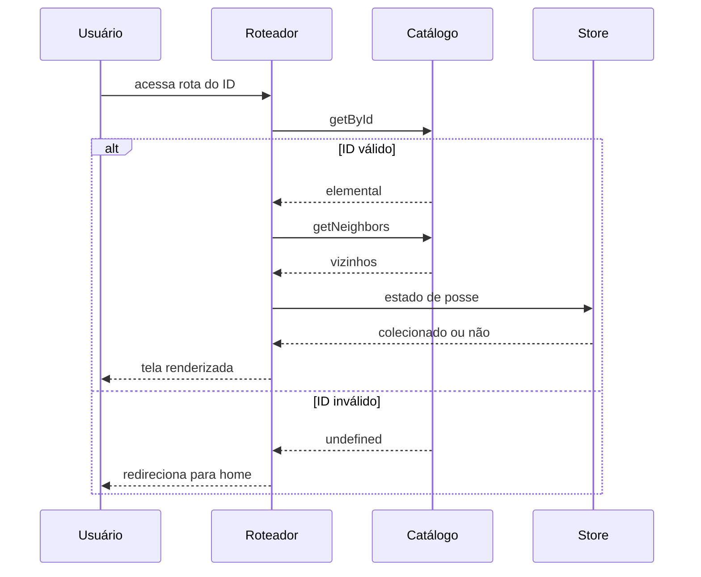
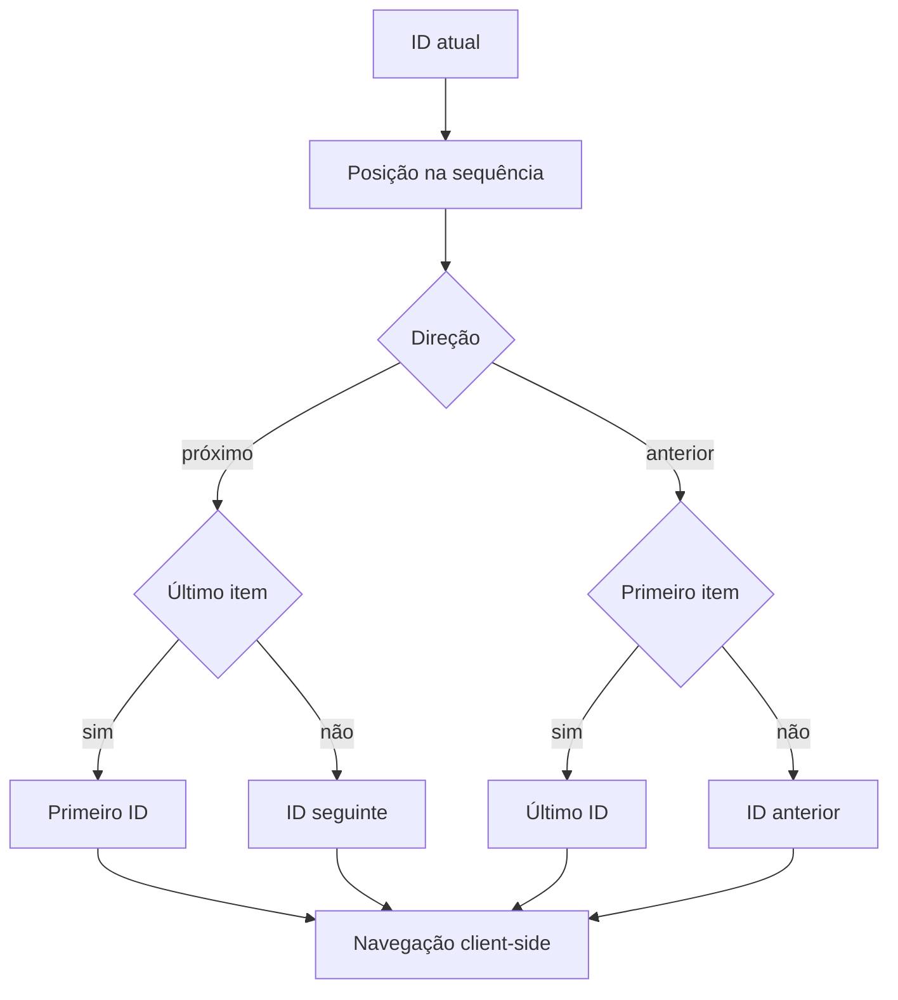
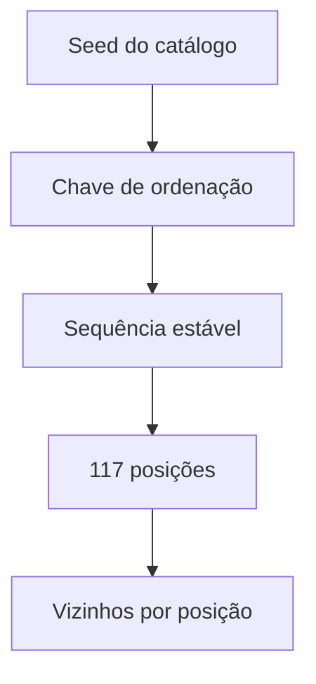
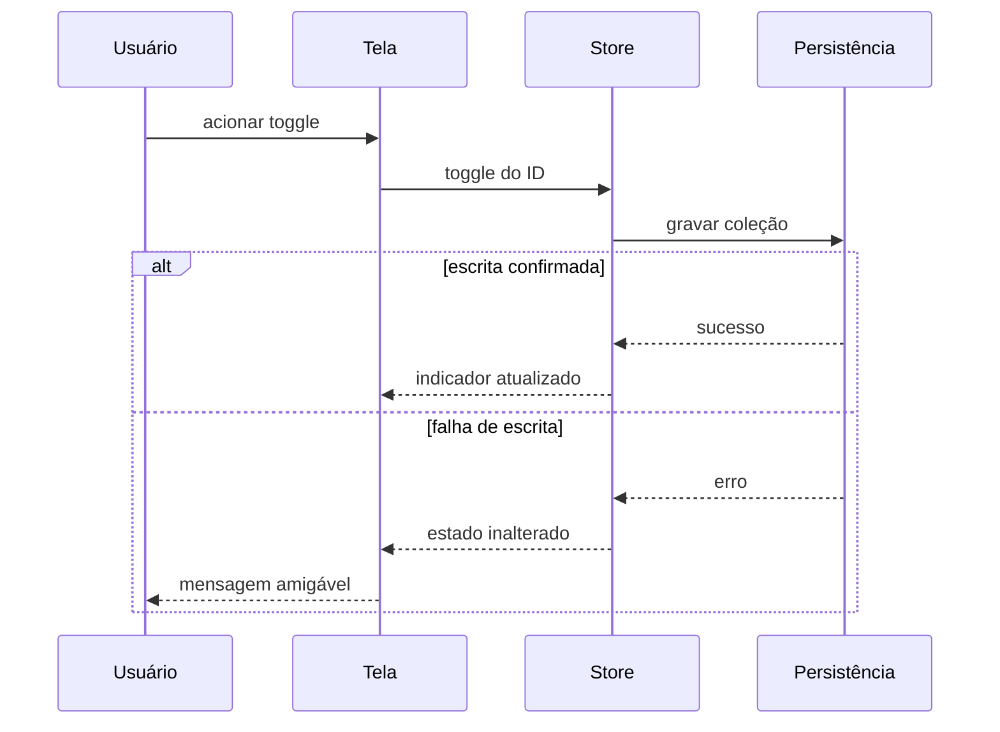
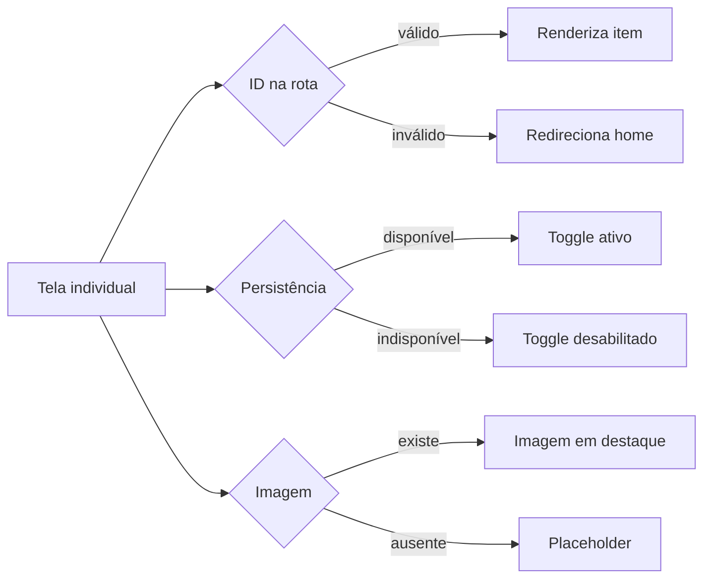
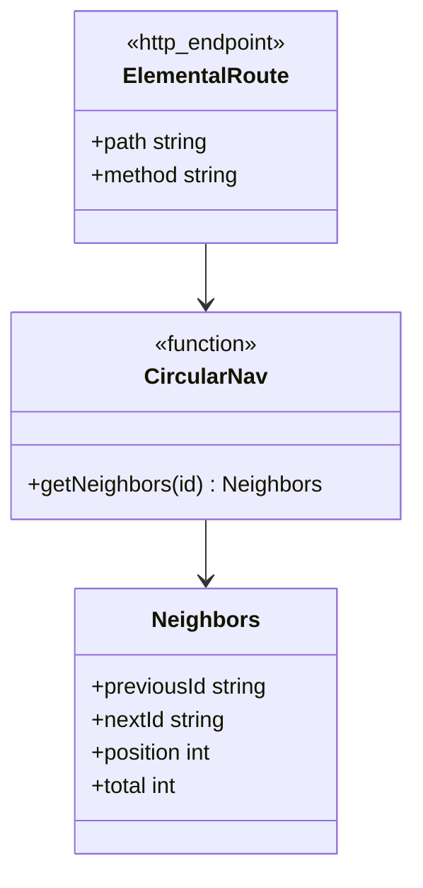

# Diagramas Mermaid - Tela Individual do Elemental

## Visão Geral

A tela individual apresenta um elemental em destaque e oferece dois comportamentos centrais: navegação circular entre os 117 itens do catálogo, com wrap-around nas extremidades, e toggle de coleção com persistência confirmada. A rota dinâmica é resolvida inteiramente no cliente, a partir do catálogo embutido no build, e a sequência de navegação é determinística e estável entre deploys. Os diagramas abaixo cobrem a visualização, o algoritmo de navegação circular, o toggle, as variações de comportamento e os contratos descritos no FDD-03.

## Elementos Identificados

### Fluxos externos

- Usuário no navegador, desktop e móvel, acessando a rota pela listagem ou por URL direta
- CDN entregando a página pré-renderizada dos 117 IDs do seed
- Redirecionamento para a página inicial em ID inválido

### Processos internos

- Resolução da rota dinâmica `/elemental/[id]` pelo roteador do SvelteKit
- Cálculo dos vizinhos anterior e próximo com wrap-around nas extremidades
- Derivação do estado de posse pela Store da coleção
- Pré-carregamento da rota vizinha antes da navegação
- Toggle de coleção com confirmação de escrita e feedback em falha

### Variações de comportamento

- ID inexistente na rota: redirecionamento para a página inicial
- IndexedDB indisponível: toggle desabilitado com aviso de modo degradado
- Falha de escrita no toggle: estado visual inalterado e mensagem amigável
- Imagem ausente: placeholder por tipo e variação

### Contratos públicos

- Rota da tela individual: `GET /elemental/{id}`, pré-renderizada para os 117 IDs
- Função de navegação circular: `getNeighbors`, com previousId, nextId, position e total

## Diagramas

### Visualização do Elemental

Este diagrama mostra a sequência de montagem da tela individual a partir do acesso à rota. O roteador resolve o parâmetro, o módulo de catálogo retorna o elemental e seus vizinhos na sequência estável, e a Store da coleção fornece o estado de posse. O caminho alternativo cobre o ID inexistente, que resulta em redirecionamento suave para a página inicial. É o fluxo de entrada de todas as interações da tela.

**Notas**

- A resolução da rota e o cálculo de vizinhos são síncronos em memória, em menos de 1 ms.
- Em acesso direto por URL, ID inexistente responde 404; em navegação client-side, redireciona.
- A tela renderiza nome, raridade, variação, imagem em destaque e estado de posse.

---

### Navegação Circular

Este diagrama detalha o algoritmo de navegação circular com wrap-around. A posição do item na sequência estável do catálogo determina os alvos de anterior e próximo: após o último item, o próximo é o primeiro; antes do primeiro, o anterior é o último. A navegação ocorre client-side, sem recarregar a página, com pré-carregamento da rota vizinha. Ele materializa a invariante de que a sequência nunca quebra, independentemente do item de entrada.

**Notas**

- A sequência percorre os 117 itens em uma única ordem, sem filtros por raridade ou tipo.
- A navegação client-side entre itens é concluída em até 100 ms.
- O ciclo se repete indefinidamente, com wrap-around garantido nas duas extremidades.

---

### Derivação da Sequência Estável

Este diagrama mostra como a ordem de navegação é derivada e por que ela permanece estável entre deploys. A sequência vem de uma chave de ordenação definida no módulo de catálogo, e não da ordem de inserção no JSON do seed. Cada ID ocupa uma posição fixa, da qual os vizinhos são calculados. A ordem só muda quando o seed muda, em novo deploy, de forma consistente para todos os usuários.

**Notas**

- Teste unitário fixa a sequência esperada para o seed atual, cobrindo a ordenação.
- A estabilidade da sequência é o que torna a navegação previsível entre sessões.
- Mudanças no seed alteram a ordem apenas no deploy seguinte, nunca em runtime.

---

### Toggle na Tela Individual

Este diagrama representa o fluxo do toggle de coleção acionado na tela individual. A Store da coleção executa a operação e comanda a gravação na persistência local. Em sucesso, o indicador visual é atualizado; em falha, o estado visual permanece inalterado e o usuário recebe mensagem amigável. Ele reforça a invariante de que o estado visual nunca diverge do conteúdo confirmado na persistência.

**Notas**

- O toggle é o único ato de escrita da tela individual.
- Com IndexedDB indisponível, o toggle fica desabilitado e o aviso de modo degradado é exibido.
- Não há falha silenciosa: todo erro de escrita gera mensagem explícita ao usuário.

---

### Variações de Comportamento

Este diagrama compara os desvios do caminho feliz em três eixos independentes: validade do ID na rota, disponibilidade da persistência e disponibilidade da imagem. Cada eixo tem um resultado de fallback claro, que nunca deixa a tela em branco. Visualização e navegação continuam funcionando mesmo com a persistência indisponível. É a visão consolidada da política de fallback da tela.

**Notas**

- URLs antigas de IDs removidos do seed são cobertas pelo redirecionamento suave.
- O placeholder segue o tipo e a variação do elemental, sem impacto funcional.
- Falhas de persistência não impedem a visualização nem a navegação circular.

---

### Contratos Públicos

Este diagrama apresenta os contratos expostos pela tela individual. A rota dinâmica é pré-renderizada para os 117 IDs do seed e permanece estável enquanto o ID existir no seed publicado. A função de navegação circular retorna os vizinhos, a posição e o total da sequência. Serve como referência de integração para as demais telas que navegam para itens específicos.

**Notas**

- A rota é `GET /elemental/{id}`, com resposta em até 200 ms com cache de CDN.
- Para ID válido, `getNeighbors` sempre retorna vizinhos válidos, com wrap-around.
- Para ID inválido, a função sinaliza redirecionamento para a página inicial.
