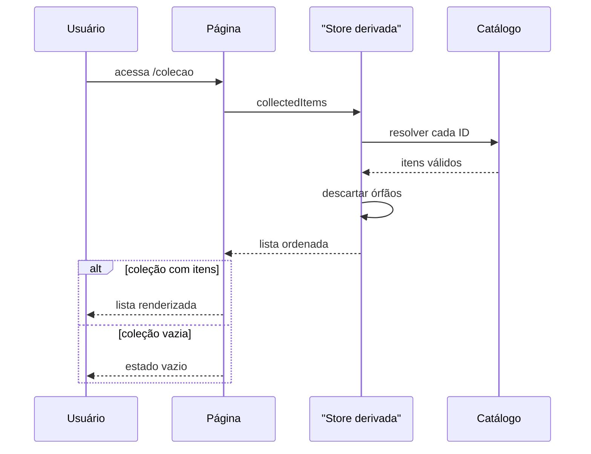
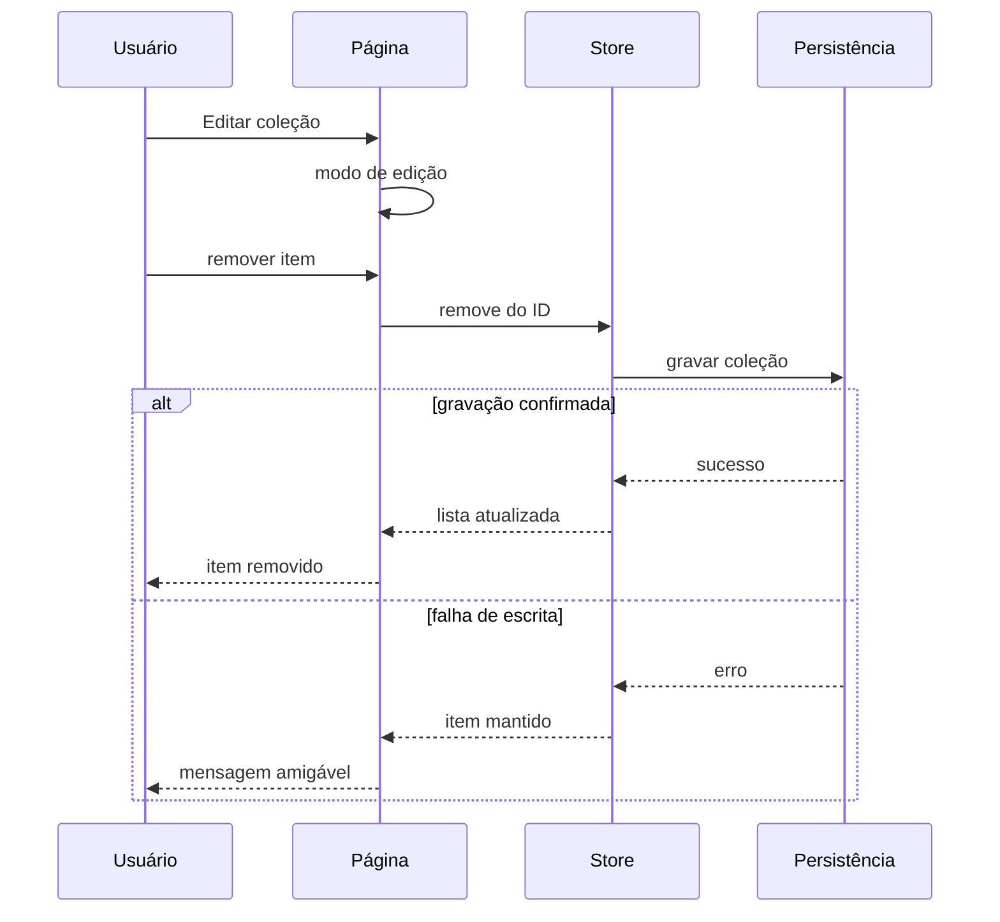
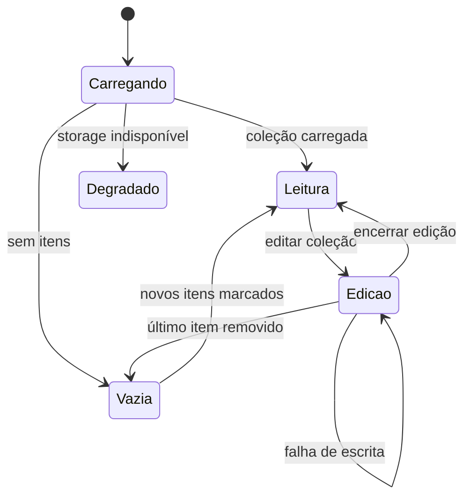
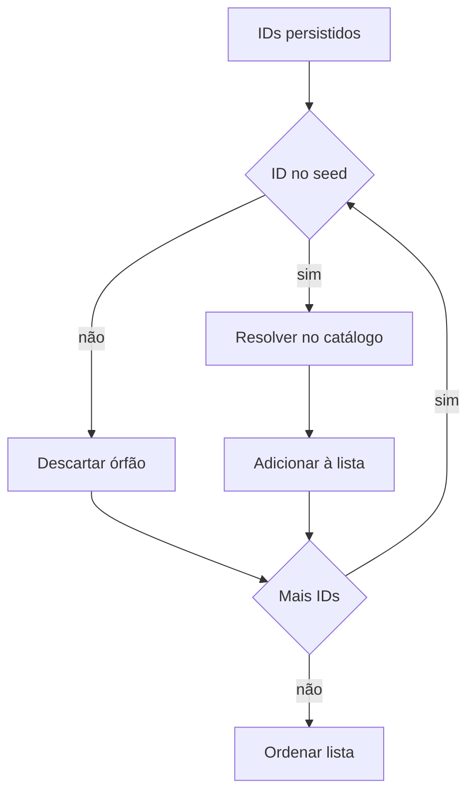
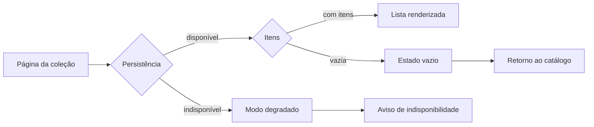
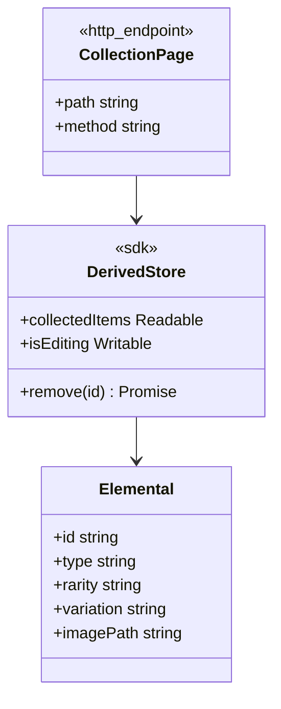

# Diagramas Mermaid - Coleção Pessoal com Modo de Edição

## Visão Geral

A página da coleção pessoal exibe apenas os elementais marcados como colecionados, derivados exclusivamente da Store da coleção resolvida contra o catálogo, e oferece um modo de edição para remoção item a item. As invariantes centrais são: órfãos nunca aparecem na tela, uma remoção só sai da lista após confirmação da gravação, e o estado vazio sempre orienta o retorno ao catálogo. Os diagramas abaixo cobrem a visualização, a remoção, os estados da página, o descarte de órfãos e os contratos descritos no FDD-04.

## Elementos Identificados

### Fluxos externos

- Usuário no navegador, desktop e móvel, acessando a página da coleção
- Adaptador de persistência confirmando cada remoção no IndexedDB
- Navegação de retorno ao catálogo a partir do estado vazio

### Processos internos

- Resolução de cada ID colecionado contra o módulo de catálogo
- Descarte automático e silencioso de IDs órfãos na composição da lista
- Modo de edição acionado pelo botão Editar coleção, com remoção item a item
- Atualização reativa da lista a cada remoção confirmada, sem recarregar a página
- Transição para o estado vazio após a remoção do último item

### Variações de comportamento

- Modo normal: lista renderizada na ordem estável do catálogo
- Modo degradado: coleção não carrega, sem lista parcial, com aviso claro
- Falha de escrita na remoção: item mantido na lista e mensagem explícita
- Estado vazio: mensagem e orientação de retorno ao catálogo

### Contratos públicos

- Página da coleção: `GET /colecao`, pré-renderizada, com lista composta no cliente
- Store derivada: `collectedItems`, `isEditing`, `remove`
- Tipo `Elemental` resolvido a partir de cada ID colecionado

## Diagramas

### Visualização da Coleção

Este diagrama mostra a sequência de composição da lista da coleção pessoal. A Store derivada resolve cada ID colecionado contra o módulo de catálogo, descartando órfãos, e emite a lista ordenada na ordem estável do catálogo. Com itens, a interface renderiza miniatura, nome, raridade, variação e check verde; sem itens, exibe o estado vazio com orientação de retorno. É o fluxo que garante que a tela exibe apenas dados confirmados e válidos.

**Notas**

- A resolução da lista ocorre em menos de 10 ms para os 117 itens.
- A ordenação da coleção segue a ordem estável do catálogo, sem ordenação customizada.
- A página apenas lista e remove; novas marcações acontecem na listagem ou na tela individual.

---

### Remoção em Modo de Edição

Este diagrama representa o fluxo de remoção de um item a partir do modo de edição. O usuário ativa a edição pelo botão Editar coleção, aciona a remoção em um item e a Store comanda a gravação na persistência. Somente após a confirmação o item sai da lista de forma reativa; em falha, o item permanece e o usuário recebe mensagem amigável. Ele materializa a proibição de remoção otimista definida na feature.

**Notas**

- A lista reage a remoções confirmadas em até 50 ms, sem recarregar a página.
- Não há retry automático na remoção; o usuário repete a ação após a mensagem de erro.
- Timeout de 2 segundos por operação de gravação, tratado como falha de escrita.

---

### Estados da Página

Este diagrama consolida os estados possíveis da página da coleção e suas transições. O carregamento converge para Leitura, Vazia ou Degradado conforme o resultado da hidratação. O modo Edição permite remoções confirmadas, que atualizam a lista reativamente, e a remoção do último item leva ao estado Vazia. É a referência central para o comportamento reativo da página.

**Notas**

- Novos itens marcados na listagem ou na tela individual fazem a página sair do estado Vazia.
- Em Degradado, a edição fica indisponível e nenhuma lista parcial é exibida.
- O estado Vazia sempre exibe orientação de retorno ao catálogo.

---

### Resolução e Descarte de Órfãos

Este diagrama detalha o algoritmo que compõe a lista a partir dos IDs persistidos. Cada ID é verificado contra o seed atual: os válidos são resolvidos no catálogo e adicionados à lista, e os órfãos são descartados de forma silenciosa, sem aparecer na tela. Ao final, a lista é ordenada pela ordem estável do catálogo. É o mecanismo que protege a página de registros antigos após atualizações do seed.

**Notas**

- O descarte de órfãos é silencioso e nunca expõe erro de storage ao usuário.
- A limpeza automática dos órfãos ocorre na próxima gravação válida da coleção.
- Teste de integração cobre seed atualizado com coleção persistida de versão anterior.

---

### Estado Vazio e Modo Degradado

Este diagrama diferencia os dois estados em que a página não exibe itens, que têm causas e mensagens distintas. O estado vazio ocorre quando a coleção existe, mas não tem itens, e orienta o retorno ao catálogo. O modo degradado ocorre quando a persistência está indisponível, informa que a coleção não pode ser carregada e orienta a verificação das configurações de storage. Essa distinção evita que o usuário interprete indisponibilidade como perda da coleção.

**Notas**

- No modo degradado, o catálogo segue acessível pelas outras páginas da aplicação.
- A coleção volta a aparecer automaticamente quando o storage estiver disponível.
- Nenhuma lista parcial ou incorreta é exibida em qualquer cenário de falha.

---

### Contratos Públicos

Este diagrama apresenta os contratos expostos pela página da coleção pessoal. A rota é pré-renderizada e estável, com a lista composta inteiramente no cliente. A Store derivada expõe a lista resolvida, o controle do modo de edição e a operação de remoção com confirmação de escrita. Serve como referência de integração para os componentes de interface que consomem a coleção.

**Notas**

- A rota é `GET /colecao`, com resposta em até 200 ms com cache de CDN.
- `remove` resolve após a gravação confirmada e rejeita mantendo o item em falha de escrita.
- O contrato da Store derivada permanece estável dentro da major version da aplicação.
