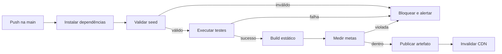
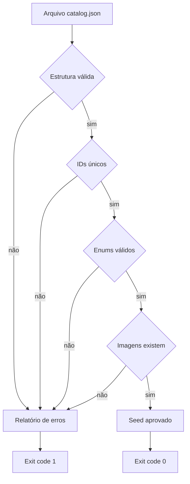
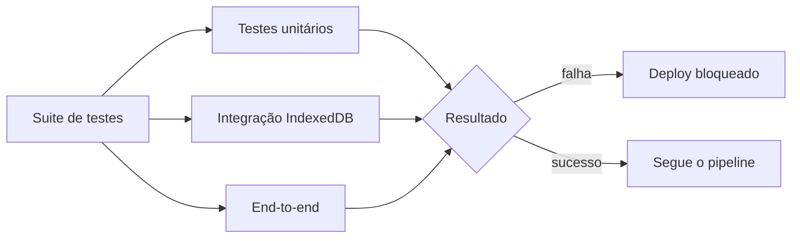
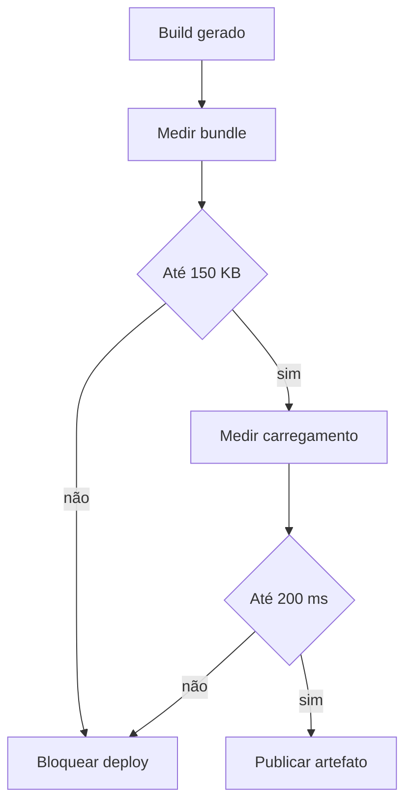
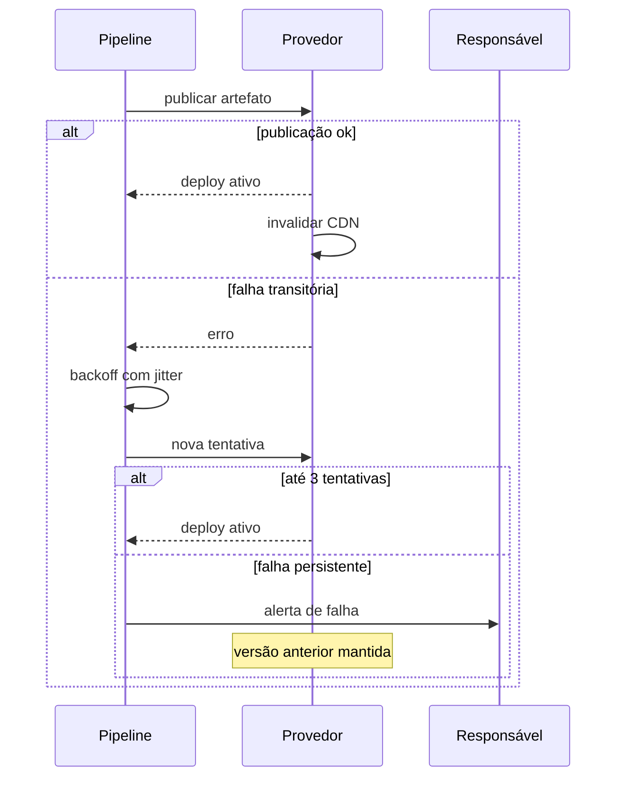
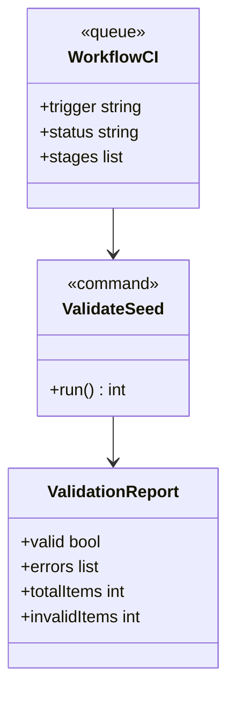

# Diagramas Mermaid - Pipeline de Build, Validação do Seed e Deploy

## Visão Geral

A aplicação é 100 por cento estática e depende de um pipeline confiável para três garantias: nenhum catálogo inválido chega a produção, as metas de engenharia são medidas a cada build e o deploy no provedor de hosting é automático e reproduzível. A feature cobre a validação de schema do seed, a suíte completa de testes, o build estático com code splitting e a publicação com artefato portável entre Netlify e Vercel. Os diagramas abaixo cobrem o fluxo do pipeline, a validação, as camadas de testes, o bloqueio por metas, a publicação com retry e os contratos descritos no FDD-05.

## Elementos Identificados

### Fluxos externos

- Desenvolvedor enviando push ou merge para a branch principal do repositório Git
- Plataforma de CI/CD executando o pipeline definido em código
- Provedor de hosting estático, Netlify ou Vercel, publicando o artefato e invalidando o CDN
- Usuário final recebendo a nova versão via CDN
- Alertas de falha enviados ao responsável técnico

### Processos internos

- Instalação de dependências com lockfile imutável
- Validação de schema do seed com relatório de erros por item
- Execução da suíte de testes: unitários, integração da persistência e end-to-end
- Build estático com Vite e code splitting por rota
- Medição do bundle inicial e do tempo de carregamento do catálogo, com bloqueio por meta
- Publicação com até 3 tentativas e backoff exponencial com jitter, base de 30 segundos

### Variações de comportamento

- Seed inválido: pipeline falha com relatório item a item e deploy bloqueado
- Falha em qualquer teste: deploy bloqueado com log da falha
- Meta de engenharia violada: deploy bloqueado com valores medidos e metas
- Falha na publicação: nova tentativa automática e, persistindo, alerta com versão anterior mantida
- Provedor indisponível: republicação do mesmo artefato no provedor alternativo

### Contratos públicos

- Script de validação do seed: `npm run validate:seed`, com exit code 0 ou 1
- Workflow de CI e deploy: gatilhos `push` e `pull_request` na branch principal
- Relatório de validação em JSON, anexado como artefato de build

## Diagramas

### Fluxo Principal do Pipeline

Este diagrama mostra o fluxo completo do pipeline, do push na branch principal até a invalidação do cache do CDN. Cada etapa atua como um portão: validação do seed, testes e metas de engenharia bloqueiam o deploy em qualquer falha. O resultado é que nenhum commit inválido, com teste falho ou com meta violada chega a produção. É a visão de referência para entender a cadeia de garantias da entrega contínua.

**Notas**

- O deploy completo a partir da branch principal ocorre em até 5 minutos.
- Apenas o commit mais recente da branch principal segue para publicação; execuções obsoletas são canceladas.
- Toda falha emite alerta ao responsável técnico e mantém a versão anterior no ar.

---

### Validação do Seed

Este diagrama detalha as verificações executadas pelo script de validação do seed. Cada item passa por checagens de estrutura, unicidade de IDs, enums de raridade e variação, e existência dos caminhos de imagem ou placeholders. Qualquer violação gera relatório de erros por item e exit code 1, bloqueando o deploy. É o mecanismo que impede que um catálogo inválido chegue a produção.

**Notas**

- A validação dos 117 itens executa em menos de 30 segundos, com entrada máxima de 1 MB de JSON.
- O relatório de erros vai para o stderr e é anexado como artefato de build.
- O schema validado é versionado junto ao seed; mudanças exigem atualização do validador no mesmo commit.

---

### Camadas de Testes

Este diagrama apresenta a composição da suíte de testes que antecede o build. Os testes unitários cobrem componentes e lógica, a integração da persistência usa `fake-indexeddb` e o end-to-end percorre o fluxo crítico com Playwright. Qualquer falha em qualquer camada bloqueia o deploy, com o log da falha disponível. É a segunda linha de defesa do pipeline, depois da validação do seed.

**Notas**

- Testes unitários usam Jest e `@testing-library/svelte`.
- A integração da persistência cobre hidratação, toggle, rollback, registro corrompido e modo degradado.
- O end-to-end com Playwright percorre o fluxo crítico da aplicação.

---

### Bloqueio por Metas de Engenharia

Este diagrama mostra como as metas de engenharia são verificadas a cada build. O bundle inicial e o tempo de carregamento do catálogo são medidos no ambiente de CI e comparados com os limites de 150 KB gzip e 200 ms. Qualquer violação bloqueia o deploy, registrando os valores medidos e as metas no log. É o mecanismo que impede a degradação gradual da experiência em dispositivos móveis.

**Notas**

- As duas medições são registradas em cada build, com histórico no painel do pipeline.
- O histórico das métricas permite detectar tendência de degradação antes do bloqueio.
- As métricas são `bundle.initial.gz_kb` e `catalog.load.duration_ms`, gauges por build.

---

### Publicação com Retry e Fallback

Este diagrama representa a etapa de publicação do artefato no provedor de hosting. Falhas transitórias disparam novas tentativas automáticas com backoff exponencial e jitter, até o limite de 3 tentativas. Persistindo a falha, o responsável é alertado e a versão anterior permanece no ar, sem exposição de deploy parcial. Em indisponibilidade prolongada, o mesmo artefato é republicado no provedor alternativo.

**Notas**

- O backoff entre tentativas é exponencial com jitter, base de 30 segundos.
- O token de deploy fica exclusivamente no cofre de segredos da plataforma de CI/CD.
- A portabilidade do artefato permite republicar em Netlify ou Vercel sem mudança de código.

---

### Contratos do Pipeline

Este diagrama apresenta os contratos expostos pela feature de pipeline. O script de validação do seed é invocado por comando npm e sinaliza o resultado por exit code, com relatório JSON detalhado. O workflow de CI é disparado por eventos na branch principal e reporta o status de cada stage. Serve como referência para quem mantém ou estende o pipeline.

**Notas**

- O comando é `npm run validate:seed`, com exit code 0 para seed válido e 1 para inválido.
- Os gatilhos do workflow são `push` e `pull_request` na branch principal.
- Os stages do pipeline são: validate_seed, tests, build, measure e deploy.
