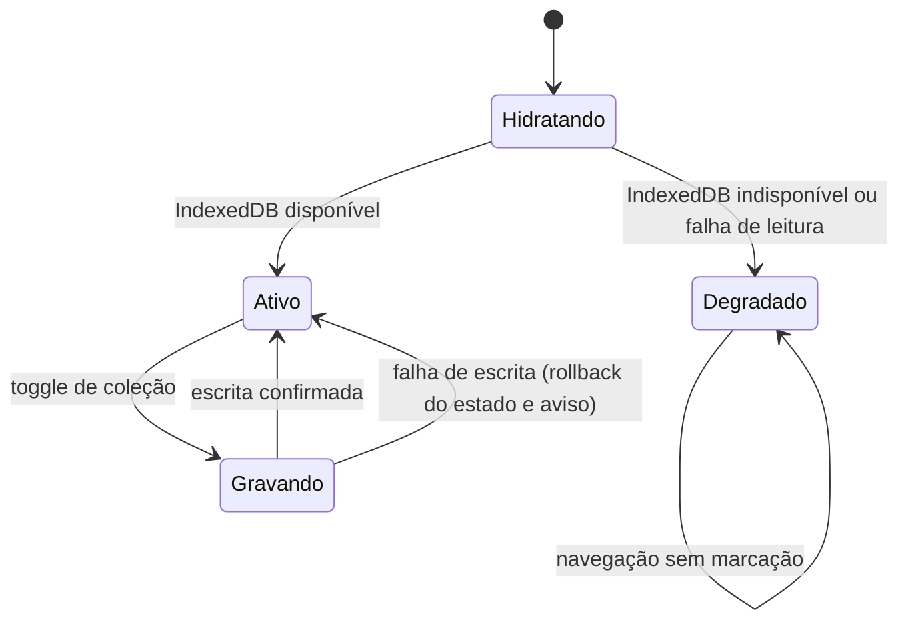

### FDD-01: Persistência da coleção no IndexedDB

Versão: 1.0
Data: 2026-08-06
Responsável: Alcir Junior

---

### 1. Contexto e motivação técnica

A coleção do usuário precisa sobreviver entre sessões sem backend e sem autenticação. Esta feature implementa a Store da coleção e o Adaptador de persistência definidos no HLD, gravando apenas IDs de elementais no IndexedDB do navegador por meio do wrapper `idb-keyval`. Ela é a fundação consumida pela listagem do catálogo, pela tela individual do elemental e pela página da coleção pessoal, e resolve também a degradação graciosa quando o storage do navegador está indisponível.

Atores

- Usuário no navegador (desktop e móvel)
- Store da coleção (Svelte Store)
- Adaptador de persistência (módulo TypeScript sobre `idb-keyval`)
- IndexedDB do navegador

Limites de escopo

- Apenas IDs de elementais são persistidos, nenhum dado pessoal ou derivado
- Nenhuma sincronização externa, replicação ou tráfego para fora do dispositivo
- Durabilidade sujeita às políticas de evicção e limpeza do navegador
- Sem criptografia adicional sobre o registro gravado

---

### 2. Objetivos técnicos

- Persistir cada alteração de marcação no IndexedDB com latência p95 de escrita abaixo de 50 ms.
- Invariante: o estado visual de posse só permanece alterado quando a gravação é confirmada; em falha de escrita, o estado anterior é restaurado e o usuário é informado.
- Hidratar a coleção na inicialização em até 100 ms em dispositivo móvel médio.
- Invariante: IDs lidos do IndexedDB que não existem no seed atual do catálogo são descartados na leitura, sem erro visível.
- Detectar indisponibilidade do IndexedDB na inicialização em 100 por cento dos casos, ativando o modo degradado.
- Solicitar persistência elevada de storage via `navigator.storage.persist()` sempre que a API estiver disponível.

---

### 3. Escopo e exclusões

**Incluído**

- Adaptador de persistência com operações de leitura e gravação do conjunto de IDs
- Store reativa da coleção com operação de toggle e derivação de estado de posse por ID
- Hidratação na inicialização com resolução dos IDs contra o catálogo e descarte de órfãos
- Detecção de indisponibilidade do IndexedDB e modo degradado com aviso ao usuário
- Tratamento de erros de leitura e escrita sem falha silenciosa
- Solicitação de `navigator.storage.persist()` na inicialização
- Testes de integração com `fake-indexeddb`

**Excluído**

- Sincronização da coleção entre dispositivos ou navegadores
- Exportação e importação da coleção em arquivo (versão futura)
- Criptografia ou ofuscação do registro persistido
- Autenticação ou identificação do usuário
- Migração de dados entre navegadores

---

### 4. Fluxos detalhados e diagramas

**Fluxo principal: hidratação na inicialização**

1. A aplicação inicializa e a Store da coleção solicita a leitura ao adaptador de persistência.
2. O adaptador verifica a disponibilidade do IndexedDB no navegador.
3. O adaptador lê o registro da coleção via `idb-keyval` (chave única `collection`).
4. Os IDs lidos são resolvidos contra o catálogo; IDs ausentes no seed atual são descartados.
5. A Store popula o conjunto reativo de IDs e as telas derivam o estado de posse de cada item.
6. A Store solicita `navigator.storage.persist()` quando a API está disponível.

**Fluxo principal: toggle de coleção**

1. O usuário aciona o toggle de coleção em um elemental.
2. A Store adiciona ou remove o ID no conjunto em memória.
3. O adaptador grava o conjunto atualizado no IndexedDB.
4. Em sucesso, o estado visual é confirmado. Em falha, a Store reverte o conjunto em memória ao estado anterior e a interface exibe mensagem amigável ao usuário.

**Fluxos alternativos e exceções**

- IndexedDB bloqueado ou ausente (modo privado ou restrito): gatilho na etapa 2 da hidratação; resultado é o modo degradado, com catálogo utilizável, marcação desabilitada e aviso claro ao usuário.
- Falha de leitura do IndexedDB: gatilho na etapa 3 da hidratação; resultado é coleção iniciada vazia, erro registrado no console e aplicação seguindo em modo degradado de leitura.
- Falha de escrita no IndexedDB: gatilho na etapa 3 do toggle; resultado é rollback do estado em memória e mensagem explícita ao usuário, sem falha silenciosa.
- Registro corrompido (conteúdo não é uma lista de strings): gatilho na etapa 4 da hidratação; resultado é descarte do registro, coleção iniciada vazia e sobrescrita na próxima gravação válida.

**Diagramas** (opcional)



---

### 5. Contratos públicos

**Adaptador de persistência**

- Tipo: sdk
- Assinatura ou rota: `loadCollection(): Promise<string[]>`, `saveCollection(ids: string[]): Promise<void>`, `isStorageAvailable(): Promise<boolean>`
- Método: N/A
- Limites: registro único com até 117 IDs (payload abaixo de 4 KB); timeout de 2 segundos por operação de storage
- Versionamento: registro versionado pelo campo `version`; versão inicial `1`; mudanças futuras de formato exigem migração na leitura
- Semântica de status e headers:
  - `loadCollection` resolve com lista de IDs válidos; nunca rejeita por registro ausente, retornando lista vazia
  - `saveCollection` rejeita com erro tipado `StorageWriteError` em falha de gravação
  - `isStorageAvailable` resolve `false` quando o IndexedDB está bloqueado ou ausente

**Exemplo de requisição**

```json
{
  "operation": "saveCollection",
  "key": "collection",
  "value": {
    "version": 1,
    "ids": ["water_gold", "fire_normal", "earth_gelatinous"]
  }
}
```

**Exemplo de resposta**

```json
{
  "operation": "loadCollection",
  "key": "collection",
  "result": {
    "version": 1,
    "ids": ["water_gold", "fire_normal"]
  },
  "discardedOrphans": ["removed_elemental_id"]
}
```

**Store da coleção**

- Tipo: sdk
- Assinatura ou rota: `collection: Readable<Set<string>>`, `has(id: string): Readable<boolean>`, `toggle(id: string): Promise<void>`, `status: Readable<'active' | 'degraded'>`
- Método: N/A
- Limites: toggle rejeita em até 2 segundos quando a escrita falha; uma gravação por vez, com serialização de toggles concorrentes
- Versionamento: contrato interno estável dentro da major version da aplicação
- Semântica de status e headers:
  - `toggle` resolve quando a gravação é confirmada e rejeita após rollback em falha
  - `status` emite `degraded` quando o storage está indisponível, habilitando o aviso na interface

**Exemplo de requisição**

```json
{
  "operation": "toggle",
  "id": "water_gold"
}
```

**Exemplo de resposta**

```json
{
  "operation": "toggle",
  "id": "water_gold",
  "collected": true,
  "persisted": true
}
```

---

### 6. Erros, exceções e fallback

**Matriz de erros**

| Condição                                        | Tratamento                                                        | Observações                                             |
| ----------------------------------------------- | ----------------------------------------------------------------- | ------------------------------------------------------- |
| Timeout em operação de storage (acima de 2 s)   | Aborta a operação e trata como falha de leitura ou escrita        | Evita travamento da inicialização ou do toggle          |
| Input inválido (ID inexistente no catálogo)     | `toggle` rejeita sem gravar; IDs órfãos lidos são descartados      | Validação sempre contra o seed atual                    |
| Falha de autorização de storage pelo navegador  | Ativa modo degradado com aviso ao usuário                         | Cobre bloqueio em modo privado ou restrição de política |
| Falha da dependência crítica (IndexedDB ausente)| Ativa modo degradado na inicialização                             | Catálogo segue utilizável sem marcação                  |
| Registro corrompido no IndexedDB                | Descarta o registro e inicia coleção vazia                        | Próxima gravação válida sobrescreve o registro          |

**Estratégias de resiliência**

- Timeouts: 2 segundos por operação de leitura ou escrita no IndexedDB.
- Retries: 1 nova tentativa automática em falha de leitura na inicialização; escrita sem retry automático, o usuário repete a ação.
- Backoff: exponencial com jitter na tentativa de leitura (base de 200 ms).
- Circuit breaker: não se aplica a storage local; falhas consecutivas colocam a feature em modo degradado até o próximo carregamento.

**Política de fallback**

- Quando o caminho principal falha, a aplicação opera em modo degradado: catálogo completo utilizável para consulta, marcação de coleção desabilitada e aviso claro de que a persistência está indisponível.

**Invariantes**

- O estado visual de posse nunca diverge do conteúdo confirmado no IndexedDB.
- Nenhuma falha de storage quebra a navegação ou a renderização do catálogo.
- Nenhum erro de storage fica silencioso; todo erro gera registro no console e, quando afeta a ação do usuário, mensagem amigável na interface.

---

### 7. Observabilidade

**Métricas**

- `storage.read.duration_ms`, histograma, dimensões: outcome (success, error), navegador
- `storage.write.duration_ms`, histograma, dimensões: outcome (success, error), navegador
- `storage.degraded_mode.activations`, contador, dimensões: motivo (blocked, read_error, unavailable)
- Contadores e histogramas mantidos em memória para diagnóstico local, sem telemetria remota nesta entrega

**Logs**

- Formato: JSON estruturado no console do navegador, apenas nível error em produção
- Campos essenciais: `feature`, `action` (load, save, hydrate, persist_request), `outcome`, `latency_ms`, `error_code`, `user_agent`
- Proteção de dados sensíveis: nenhum dado pessoal existe na feature; logs nunca incluem a lista completa de IDs da coleção, apenas contadores

**Tracing**

- Spans principais: não se aplica distributed tracing, pois não há chamadas entre serviços; a depuração usa os logs locais e o painel de performance do navegador
- Amostragem: 100 por cento dos erros de storage registrados no console

**Dashboards e alertas**

- Painel de métricas do provedor de hosting para disponibilidade geral da aplicação
- Alerta de falha de build no pipeline cobre regressões da camada de persistência detectadas pelos testes com `fake-indexeddb`
- Critério de produção: console livre de erros em navegação normal

---

### 8. Dependências e compatibilidade

| Componente          | Versão mínima | Observações                                          |
| ------------------- | ------------- | ---------------------------------------------------- |
| `idb-keyval`        | 6.2           | Wrapper chave-valor sobre IndexedDB                  |
| Svelte              | 5.0           | Stores reativas (`writable`, `derived`)              |
| SvelteKit           | 2.0           | Pré-renderização estática                            |
| TypeScript          | 5.4           | Tipagem do registro e dos contratos da Store         |
| `fake-indexeddb`    | 6.0           | Simulação do IndexedDB nos testes de integração      |
| Navegadores alvo    | versões correntes e penúltima de Chrome, Firefox, Safari e Edge | Suporte a IndexedDB e `navigator.storage` |

**Garantias de compatibilidade**

- O formato do registro persistido é versionado pelo campo `version`; leituras de versões antigas são migradas ou descartadas sem erro.
- A Store da coleção mantém contrato estável (`collection`, `has`, `toggle`, `status`) dentro da major version da aplicação.
- Coleções gravadas por builds anteriores continuam válidas após novos deploys, desde que os IDs existam no seed atual.

---

### 9. Critérios de aceite técnicos

- Marcar e desmarcar um elemental persiste entre sessões: após recarregar a página, a coleção reflete a última gravação confirmada.
- Em falha de escrita simulada, o estado visual permanece inalterado e o usuário recebe mensagem explícita.
- IDs inexistentes no seed são removidos da coleção na leitura, sem erro visível e sem travar a hidratação.
- Com IndexedDB bloqueado (modo privado simulado), a aplicação carrega o catálogo, desabilita a marcação e exibe o aviso de modo degradado.
- Latência p95 de escrita no IndexedDB abaixo de 50 ms em dispositivo móvel médio.
- Hidratação da coleção concluída em até 100 ms na inicialização.
- `navigator.storage.persist()` é solicitado em navegadores que suportam a API.
- Testes de integração com `fake-indexeddb` cobrem hidratação, toggle com sucesso, falha de escrita com rollback, registro corrompido e modo degradado.
- Nenhum erro não tratado aparece no console durante o fluxo crítico.

---

### 10. Riscos e mitigação

#### Perda da coleção por limpeza ou evicção do IndexedDB

- **Probabilidade:** media
- **Impacto:** perda total do histórico de coleta do usuário, sem possibilidade de recuperação.
- **Mitigação:**
  - Solicitar persistência elevada de storage via `navigator.storage.persist()` quando disponível.
  - Manter aviso permanente na página inicial informando que a coleção é local e será apagada com a limpeza dos dados do navegador.
- **Plano de contingência:** em versão futura, oferecer exportação e importação da coleção em arquivo; nesta entrega, o usuário remarca os itens manualmente.

#### Navegador bloqueia o IndexedDB (modo restrito ou privado)

- **Probabilidade:** baixa
- **Impacto:** impossibilidade de persistir a coleção para o usuário afetado.
- **Mitigação:**
  - Detectar a indisponibilidade na inicialização e ativar degradação graciosa.
  - Tratar erros de leitura e escrita com feedback explícito, sem falhas silenciosas.
- **Plano de contingência:** a aplicação continua utilizável para consulta ao catálogo mesmo sem persistência.

#### Registro da coleção corrompido ou em formato antigo

- **Probabilidade:** baixa
- **Impacto:** coleção aparenta estar vazia para o usuário afetado.
- **Mitigação:**
  - Validar a estrutura do registro na leitura (lista de strings com campo `version`).
  - Descartar registros inválidos e sobrescrever na próxima gravação válida.
- **Plano de contingência:** o usuário remarca os itens; o registro é reconstruído automaticamente a partir do primeiro toggle válido.
