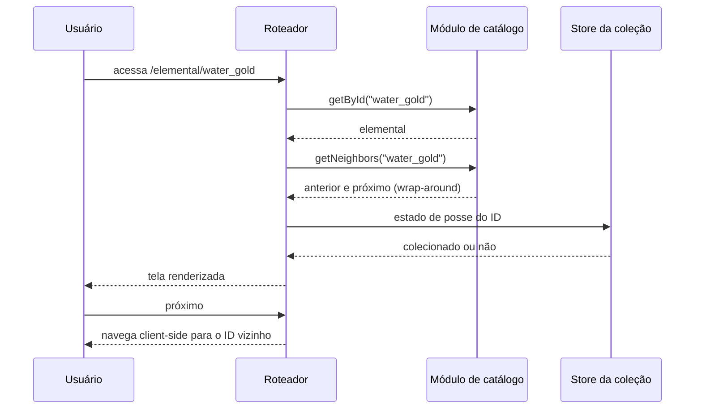

### FDD-03: Tela individual do elemental com navegação circular

Versão: 1.0
Data: 2026-08-06
Responsável: Alcir Junior

---

### 1. Contexto e motivação técnica

A tela individual apresenta um elemental em destaque (nome, raridade, variação e imagem ampliada) e oferece dois comportamentos centrais: navegação circular entre itens do catálogo (anterior e próximo, com retorno ao primeiro após o último) e toggle de coleção com persistência. O problema técnico é manter a ordem de navegação determinística e estável entre deploys, resolver a rota dinâmica inteiramente no cliente e garantir que o toggle respeite a invariante de confirmação de escrita definida na camada de persistência.

Atores

- Usuário no navegador (desktop e móvel)
- Roteador do SvelteKit (rota dinâmica client-side)
- Módulo de catálogo (consulta por ID e sequência estável)
- Store da coleção (toggle e estado de posse)

Limites de escopo

- A navegação circular percorre o catálogo completo em uma única sequência, sem filtros por raridade ou tipo
- O toggle de coleção é o único ato de escrita da tela
- Nenhum dado é buscado em rede para montar a tela; tudo vem do catálogo embutido no build

---

### 2. Objetivos técnicos

- Resolver a rota dinâmica e renderizar o elemental em até 100 ms em navegação client-side.
- Invariante: a sequência de navegação circular é determinística, derivada da ordem estável do catálogo, e idêntica entre sessões para o mesmo seed.
- Invariante: após o último item, o próximo é o primeiro; antes do primeiro, o anterior é o último.
- Invariante: o estado visual do toggle só reflete alteração confirmada na persistência; em falha, permanece inalterado.
- Exibir placeholder de imagem em 100 por cento dos casos em que o asset final não existe.

---

### 3. Escopo e exclusões

**Incluído**

- Rota dinâmica `/elemental/[id]` pré-renderizada para os 117 IDs do seed
- Exibição de nome, raridade, variação e imagem em destaque
- Navegação circular anterior e próximo com pré-carregamento da rota seguinte
- Toggle de coleção integrado à Store da coleção, com feedback em falha de escrita
- Tratamento de ID inválido na rota com redirecionamento para a página inicial

**Excluído**

- Navegação filtrada por raridade, tipo ou variação
- Zoom, galeria ou múltiplas imagens por elemental
- Metadados dinâmicos de compartilhamento por item
- Histórico de visualização ou itens recentes
- Animações complexas de transição entre itens

---

### 4. Fluxos detalhados e diagramas

**Fluxo principal: visualização e navegação circular**

1. O usuário acessa `/elemental/[id]` pela listagem do catálogo ou por URL direta.
2. O roteador resolve o parâmetro `id` e o módulo de catálogo retorna o elemental correspondente.
3. A tela renderiza nome, raridade, variação, imagem em destaque e o estado de posse derivado da Store da coleção.
4. A posição do item na sequência estável do catálogo determina os alvos de anterior e próximo, com wrap-around nas extremidades.
5. Ao acionar anterior ou próximo, o SvelteKit navega client-side para o ID vizinho, com pré-carregamento da rota.
6. O ciclo se repete sem recarregar a página.

**Fluxo principal: toggle de coleção**

1. O usuário aciona o toggle de coleção na tela individual.
2. A Store da coleção executa o toggle e comanda a gravação na persistência local.
3. Em sucesso, o indicador visual é atualizado. Em falha, o estado visual permanece inalterado e o usuário recebe mensagem amigável.

**Fluxos alternativos e exceções**

- ID inexistente na rota: gatilho na etapa 2 da visualização; resultado é redirecionamento para a página inicial.
- Imagem do elemental indisponível: gatilho na etapa 3; resultado é exibição do placeholder do tipo e variação correspondentes.
- IndexedDB indisponível no toggle: gatilho na etapa 2 do toggle; resultado é toggle desabilitado com aviso de modo degradado.
- Falha de escrita no toggle: gatilho na etapa 3 do toggle; resultado é estado visual inalterado e mensagem explícita ao usuário.

**Diagramas** (opcional)



---

### 5. Contratos públicos

**Rota da tela individual**

- Tipo: http_endpoint
- Assinatura ou rota: `GET /elemental/{id}`
- Método: GET
- Limites: resposta em até 200 ms com cache de CDN; navegação client-side subsequente em até 100 ms
- Versionamento: formato da URL estável; IDs válidos são exatamente os presentes no seed publicado
- Semântica de status e headers:
  - `200 OK`: página pré-renderizada do elemental entregue pelo CDN
  - `404`: ID inexistente no seed publicado; a navegação client-side redireciona para a página inicial
  - `cache-control`: HTML com revalidação a cada deploy; assets com hash imutável e cache longo

**Exemplo de requisição**

```json
{
  "method": "GET",
  "path": "/elemental/water_gold",
  "headers": {
    "accept": "text/html"
  }
}
```

**Exemplo de resposta**

```json
{
  "status": 200,
  "headers": {
    "content-type": "text/html; charset=utf-8",
    "cache-control": "public, max-age=0, must-revalidate"
  },
  "body": "HTML pré-renderizado da tela individual do elemental water_gold"
}
```

**Função de navegação circular**

- Tipo: function
- Assinatura ou rota: `getNeighbors(id: string): { previousId: string; nextId: string; position: number; total: number }`
- Método: N/A
- Limites: resolução em memória em menos de 1 ms; sequência de 117 itens na ordem estável do catálogo
- Versionamento: a ordem estável é derivada do seed e só muda quando o seed muda, em novo deploy
- Semântica de status e headers:
  - Para ID válido, sempre retorna vizinhos válidos, com wrap-around nas extremidades
  - Para ID inválido, sinaliza redirecionamento para a página inicial

**Exemplo de requisição**

```json
{
  "operation": "getNeighbors",
  "id": "water_gold"
}
```

**Exemplo de resposta**

```json
{
  "previousId": "water_normal",
  "nextId": "water_gelatinous",
  "position": 42,
  "total": 117
}
```

---

### 6. Erros, exceções e fallback

**Matriz de erros**

| Condição                             | Tratamento                                                             | Observações                                            |
| ------------------------------------ | ---------------------------------------------------------------------- | ------------------------------------------------------ |
| Timeout na carga inicial da rota     | Mantém estado de carregamento até a entrega dos assets pelo CDN        | Navegações subsequentes são locais, sem rede           |
| Input inválido (ID inexistente)      | Redireciona para a página inicial                                      | Cobre URLs antigas de IDs removidos do seed            |
| Falha de autorização                 | Não se aplica: conteúdo público e sem autenticação, por decisão de produto | Documentado no HLD e no ADR 001                    |
| Falha da dependência de persistência | Toggle desabilitado com aviso de modo degradado                        | Visualização e navegação seguem funcionando            |
| Falha de escrita no toggle           | Estado visual inalterado e mensagem amigável ao usuário                | Sem falha silenciosa                                   |

**Estratégias de resiliência**

- Timeouts: 2 segundos para a carga inicial da rota; resoluções de catálogo e vizinhos são síncronas em memória.
- Retries: o pré-carregamento da rota vizinha é tentado novamente na próxima navegação em caso de falha.
- Backoff: não se aplica, pois não há chamadas a backend.
- Circuit breaker: não se aplica; a única dependência externa é o CDN, protegido por cache de edge.

**Política de fallback**

- Falhas de persistência não impedem a visualização nem a navegação circular; apenas o toggle é desabilitado, com aviso claro. Falhas de imagem caem no placeholder por tipo e variação.

**Invariantes**

- A sequência de navegação circular nunca quebra, independentemente do item de entrada.
- O estado visual do toggle nunca diverge do conteúdo confirmado na persistência.
- A tela individual nunca fica em branco por ID inválido; sempre há redirecionamento.

---

### 7. Observabilidade

**Métricas**

- `elemental.view.duration_ms`, histograma em memória, dimensões: origem (listagem, url_direta, navegacao_circular)
- `elemental.navigation.count`, contador em memória, dimensões: direção (anterior, proximo)
- `elemental.toggle.outcome`, contador em memória, dimensões: outcome (success, error)
- Métricas do provedor de hosting: requisições e códigos de status das rotas `/elemental/*`

**Logs**

- Formato: JSON estruturado no console do navegador, apenas nível error em produção
- Campos essenciais: `feature`, `action` (route_resolve, neighbor_resolve, toggle), `outcome`, `elemental_id`, `latency_ms`
- Proteção de dados sensíveis: apenas o ID do elemental é registrado; nenhum dado pessoal existe na feature

**Tracing**

- Spans principais: não se aplica distributed tracing, pois a navegação é client-side e o único recurso externo é o CDN
- Amostragem: 100 por cento dos erros registrados no console

**Dashboards e alertas**

- Painel do provedor de hosting com códigos de status por rota, acompanhando o volume de 404 em `/elemental/*`
- Alerta de falha de build no pipeline cobre rotas não pré-renderizadas ou IDs quebrados

---

### 8. Dependências e compatibilidade

| Componente       | Versão mínima | Observações                                                   |
| ---------------- | ------------- | ------------------------------------------------------------- |
| Svelte           | 5.0           | Componente da tela e derivados reativos                       |
| SvelteKit        | 2.0           | Rota dinâmica, pré-renderização e pré-carregamento            |
| Vite             | 5.0           | Code splitting da rota individual                             |
| TypeScript       | 5.4           | Tipagem do parâmetro de rota e dos vizinhos                   |
| Navegadores alvo | versões correntes e penúltima de Chrome, Firefox, Safari e Edge | Navegação client-side e History API |

**Garantias de compatibilidade**

- URLs `/elemental/{id}` permanecem válidas enquanto o ID existir no seed publicado.
- IDs removidos do seed geram redirecionamento suave para a página inicial, nunca erro fatal.
- A ordem estável de navegação só muda em novo deploy, de forma consistente para todos os usuários.

---

### 9. Critérios de aceite técnicos

- A rota `/elemental/{id}` renderiza nome, raridade, variação e imagem em destaque para cada um dos 117 IDs do seed.
- A navegação circular percorre os 117 itens e retorna ao primeiro após o último, e ao último antes do primeiro, na ordem estável do catálogo.
- Navegação client-side entre itens concluída em até 100 ms.
- O toggle de coleção persiste a alteração e, em falha de escrita simulada, o estado visual permanece inalterado com mensagem ao usuário.
- ID inexistente na rota redireciona para a página inicial em navegação client-side e responde 404 em acesso direto.
- Item sem asset final exibe o placeholder correspondente ao tipo e variação.
- Nenhum erro não tratado aparece no console durante a navegação circular completa.

---

### 10. Riscos e mitigação

#### Ordem de navegação instável entre deploys

- **Probabilidade:** media
- **Impacto:** usuários percebem sequência de navegação diferente após atualizações do catálogo, quebrando a previsibilidade.
- **Mitigação:**
  - Derivar a sequência de uma chave de ordenação estável definida no módulo de catálogo, e não da ordem de inserção no JSON.
  - Cobrir a ordenação com teste unitário que fixa a sequência esperada para o seed atual.
- **Plano de contingência:** ajustar a chave de ordenação e publicar novo deploy; a navegação volta a ser consistente no próximo carregamento.

#### URLs de IDs removidos do seed quebram a experiência

- **Probabilidade:** baixa
- **Impacto:** acesso a URL antiga resulta em erro ou tela vazia.
- **Mitigação:**
  - Redirecionamento client-side para a página inicial em ID inválido.
  - Pré-renderização de 404 com orientação de retorno ao catálogo.
- **Plano de contingência:** manter redirecionamentos permanentes no provedor de hosting para IDs removidos de alto tráfego, quando identificados.

#### Assets de imagem em destaque não entregues a tempo

- **Probabilidade:** media
- **Impacto:** experiência visual degradada na tela de maior destaque, sem impacto funcional.
- **Mitigação:**
  - Placeholders consistentes por tipo e variação.
  - Caminhos padronizados (`assets/elementals/<tipo>/`) permitindo substituição direta dos arquivos.
- **Plano de contingência:** lançar com placeholders e adicionar os assets reais em iteração posterior, por novo deploy estático.
