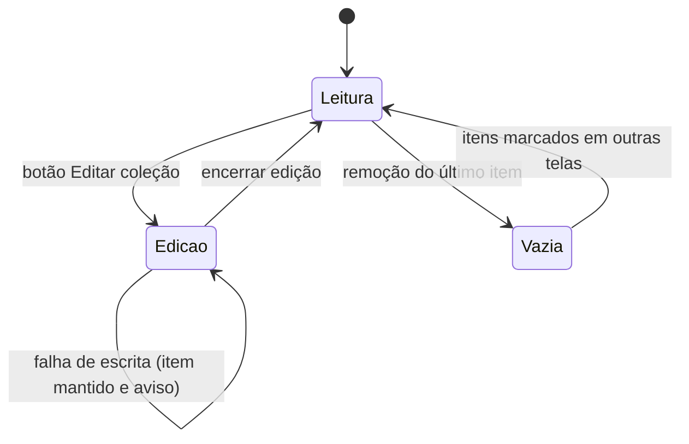

### FDD-04: Coleção pessoal com modo de edição

Versão: 1.0
Data: 2026-08-06
Responsável: Alcir Junior

---

### 1. Contexto e motivação técnica

A página da coleção pessoal apresenta apenas os elementais que o usuário marcou como colecionados, com miniatura, nome, raridade, variação e check verde, e oferece um modo de edição acionado pelo botão Editar coleção para remover itens. O problema técnico é derivar essa visão exclusivamente da Store da coleção resolvida contra o catálogo, manter a lista reativa a cada remoção confirmada na persistência e tratar o estado de coleção vazia sem expor IDs órfãos ou erros de storage ao usuário.

Atores

- Usuário no navegador (desktop e móvel)
- Store da coleção (conjunto de IDs e derivação de itens colecionados)
- Módulo de catálogo (resolução de ID para dados de exibição)
- Adaptador de persistência (confirmação de cada remoção)

Limites de escopo

- A página apenas lista e remove itens; novas marcações acontecem na listagem do catálogo ou na tela individual
- A ordenação da coleção segue a ordem estável do catálogo, sem ordenação customizada pelo usuário
- Nenhuma estatística agregada (percentual de conclusão, contadores por raridade) nesta entrega

---

### 2. Objetivos técnicos

- Renderizar a coleção resolvida contra o catálogo em até 100 ms após a hidratação da Store.
- Invariante: a lista exibe apenas IDs presentes no seed atual; órfãos nunca aparecem na tela.
- Invariante: uma remoção só sai da lista após confirmação da gravação na persistência; em falha, o item permanece e o usuário é informado.
- Atualizar a lista de forma reativa a cada remoção confirmada, sem recarregar a página, em até 50 ms.
- Exibir estado vazio com orientação de retorno ao catálogo em 100 por cento dos casos de coleção sem itens.

---

### 3. Escopo e exclusões

**Incluído**

- Página da coleção com miniatura, nome, raridade, variação e check verde por item
- Store derivada que resolve os IDs colecionados contra o catálogo
- Modo de edição acionado pelo botão Editar coleção, com remoção item a item
- Estado vazio com mensagem e navegação de retorno ao catálogo
- Descarte automático de IDs órfãos na composição da lista

**Excluído**

- Marcação de novos itens a partir desta página
- Remoção em lote ou seleção múltipla
- Ordenação, filtros ou busca dentro da coleção
- Estatísticas de progresso da coleção
- Exportação ou compartilhamento da coleção

---

### 4. Fluxos detalhados e diagramas

**Fluxo principal: visualização da coleção**

1. O usuário acessa a página da coleção.
2. A Store derivada resolve cada ID colecionado contra o módulo de catálogo, descartando órfãos.
3. A interface renderiza a lista na ordem estável do catálogo, com miniatura, nome, raridade, variação e check verde por item.
4. Com a coleção vazia, a interface exibe o estado vazio com orientação de retorno ao catálogo.

**Fluxo principal: edição e remoção**

1. O usuário aciona o botão Editar coleção e a lista entra em modo de edição.
2. O usuário aciona a remoção em um item.
3. A Store executa o toggle do ID e comanda a gravação na persistência local.
4. Em sucesso, o item sai da lista de forma reativa. Em falha, o item permanece e o usuário recebe mensagem amigável.
5. O usuário encerra o modo de edição e a lista volta ao estado de leitura.

**Fluxos alternativos e exceções**

- IndexedDB indisponível: gatilho na etapa 2 da visualização; resultado é página em modo degradado, sem exibir itens e com aviso de que a coleção não pode ser carregada.
- Falha de escrita na remoção: gatilho na etapa 4 da edição; resultado é item mantido na lista e mensagem explícita ao usuário.
- ID órfão na coleção: gatilho na etapa 2 da visualização; resultado é descarte silencioso do órfão, que nunca aparece na lista.
- Remoção do último item: gatilho na etapa 4 da edição; resultado é transição para o estado vazio.

**Diagramas** (opcional)



---

### 5. Contratos públicos

**Página da coleção**

- Tipo: http_endpoint
- Assinatura ou rota: `GET /colecao`
- Método: GET
- Limites: resposta em até 200 ms com cache de CDN; conteúdo da lista derivado localmente, sem rede
- Versionamento: rota estável dentro da major version da aplicação
- Semântica de status e headers:
  - `200 OK`: página pré-renderizada entregue pelo CDN; a lista é composta no cliente
  - `cache-control`: HTML com revalidação a cada deploy

**Exemplo de requisição**

```json
{
  "method": "GET",
  "path": "/colecao",
  "headers": {
    "accept": "text/html"
  }
}
```

**Exemplo de resposta**

```json
{
  "status": 200,
  "headers": {
    "content-type": "text/html; charset=utf-8",
    "cache-control": "public, max-age=0, must-revalidate"
  },
  "body": "HTML pré-renderizado da página da coleção; lista composta no cliente"
}
```

**Store derivada da coleção**

- Tipo: sdk
- Assinatura ou rota: `collectedItems: Readable<Elemental[]>`, `isEditing: Writable<boolean>`, `remove(id: string): Promise<void>`
- Método: N/A
- Limites: resolução da lista em menos de 10 ms para 117 itens; remoção confirmada em p95 abaixo de 50 ms
- Versionamento: contrato interno estável dentro da major version da aplicação
- Semântica de status e headers:
  - `collectedItems` emite a lista resolvida e ordenada a cada mudança confirmada
  - `remove` resolve após a gravação confirmada e rejeita mantendo o item em falha de escrita

**Exemplo de requisição**

```json
{
  "operation": "remove",
  "id": "water_gold"
}
```

**Exemplo de resposta**

```json
{
  "operation": "collectedItems",
  "items": [
    {
      "id": "fire_normal",
      "type": "fire",
      "rarity": "Raro",
      "variation": "Normal",
      "imagePath": "assets/elementals/fire/fire_normal.webp"
    }
  ],
  "total": 1
}
```

---

### 6. Erros, exceções e fallback

**Matriz de erros**

| Condição                             | Tratamento                                                        | Observações                                    |
| ------------------------------------ | ----------------------------------------------------------------- | ---------------------------------------------- |
| Timeout na gravação da remoção       | Trata como falha de escrita, mantendo o item na lista             | Timeout de 2 segundos por operação de storage  |
| Input inválido (ID fora do catálogo) | Órfão descartado na composição da lista; remoção rejeitada        | Lista nunca exibe itens inexistentes           |
| Falha de autorização de storage      | Página em modo degradado, sem lista e com aviso ao usuário        | Cobre bloqueio do IndexedDB pelo navegador     |
| Falha da dependência de persistência | Modo degradado: coleção não carrega e edição fica indisponível    | Catálogo segue acessível pelas outras páginas  |

**Estratégias de resiliência**

- Timeouts: 2 segundos por operação de gravação na remoção de item.
- Retries: sem retry automático na remoção; o usuário repete a ação após a mensagem de erro.
- Backoff: não se aplica à remoção; a hidratação da Store segue a política da camada de persistência.
- Circuit breaker: não se aplica a storage local; falhas consecutivas ativam o modo degradado até o próximo carregamento.

**Política de fallback**

- Sem acesso à persistência, a página da coleção informa que a coleção não pode ser carregada e orienta o usuário a consultar o catálogo; nenhuma lista parcial ou incorreta é exibida.

**Invariantes**

- A lista exibida reflete apenas gravações confirmadas na persistência.
- IDs órfãos nunca aparecem na tela, mesmo persistidos no registro.
- Falha de escrita nunca remove visualmente um item que continua persistido.

---

### 7. Observabilidade

**Métricas**

- `collection.page.render.duration_ms`, histograma em memória, dimensões: outcome (success, degraded)
- `collection.remove.outcome`, contador em memória, dimensões: outcome (success, error)
- `collection.items.total`, gauge em memória, dimensões: nenhuma
- Métricas do provedor de hosting: requisições e códigos de status da rota `/colecao`

**Logs**

- Formato: JSON estruturado no console do navegador, apenas nível error em produção
- Campos essenciais: `feature`, `action` (resolve_items, edit_mode, remove), `outcome`, `elemental_id`, `latency_ms`
- Proteção de dados sensíveis: apenas IDs de elementais são registrados; nenhum dado pessoal existe na feature

**Tracing**

- Spans principais: não se aplica distributed tracing, pois não há chamadas entre serviços
- Amostragem: 100 por cento dos erros registrados no console

**Dashboards e alertas**

- Painel do provedor de hosting para a rota `/colecao`
- Alerta de falha de build no pipeline cobre regressões detectadas pelos testes do fluxo de edição

---

### 8. Dependências e compatibilidade

| Componente       | Versão mínima | Observações                                          |
| ---------------- | ------------- | ---------------------------------------------------- |
| Svelte           | 5.0           | Lista reativa e modo de edição                       |
| SvelteKit        | 2.0           | Pré-renderização da rota `/colecao`                  |
| TypeScript       | 5.4           | Tipagem da Store derivada e dos itens resolvidos     |
| `idb-keyval`     | 6.2           | Confirmação de escrita nas remoções                  |
| Navegadores alvo | versões correntes e penúltima de Chrome, Firefox, Safari e Edge | IndexedDB para carregar a coleção |

**Garantias de compatibilidade**

- A rota `/colecao` permanece estável entre deploys.
- A composição da lista tolera registros antigos da coleção, descartando órfãos sem migração destrutiva.
- O contrato da Store derivada (`collectedItems`, `isEditing`, `remove`) permanece estável dentro da major version.

---

### 9. Critérios de aceite técnicos

- A página exibe exatamente os itens colecionados, resolvidos contra o catálogo, com miniatura, nome, raridade, variação e check verde.
- IDs órfãos persistidos não aparecem na lista em nenhum cenário.
- O botão Editar coleção ativa o modo de edição e a remoção de um item o retira da lista somente após gravação confirmada.
- Em falha de escrita simulada, o item permanece na lista e o usuário recebe mensagem explícita.
- Com a coleção vazia, o estado vazio é exibido com orientação de retorno ao catálogo.
- Com IndexedDB indisponível, a página informa que a coleção não pode ser carregada, sem exibir lista parcial.
- A lista reage a remoções confirmadas em até 50 ms, sem recarregar a página.
- Nenhum erro não tratado aparece no console durante o fluxo de edição completo.

---

### 10. Riscos e mitigação

#### Falha de escrita durante a remoção deixa a interface inconsistente

- **Probabilidade:** baixa
- **Impacto:** usuário acredita que removeu um item que continua persistido.
- **Mitigação:**
  - Remoção otimista proibida: o item só sai da lista após confirmação da gravação.
  - Mensagem explícita em falha, orientando nova tentativa.
- **Plano de contingência:** em falhas recorrentes, orientar o usuário a recarregar a página, restaurando a lista a partir do registro persistido.

#### Registro da coleção com IDs órfãos após atualização do seed

- **Probabilidade:** media
- **Impacto:** contagem ou exibição incorreta da coleção, se não tratado.
- **Mitigação:**
  - Resolução da lista sempre contra o seed atual, com descarte de órfãos.
  - Teste de integração cobrindo seed atualizado com coleção persistida de versão anterior.
- **Plano de contingência:** limpeza automática dos órfãos na próxima gravação válida da coleção.

#### IndexedDB indisponível esvazia a página sem orientação

- **Probabilidade:** baixa
- **Impacto:** usuário interpreta perda da coleção.
- **Mitigação:**
  - Modo degradado com mensagem clara de que a coleção não pôde ser carregada, distinta do estado de coleção vazia.
  - Orientação de verificação das configurações de storage do navegador.
- **Plano de contingência:** aplicação segue utilizável para consulta ao catálogo; a coleção volta a aparecer quando o storage estiver disponível.
