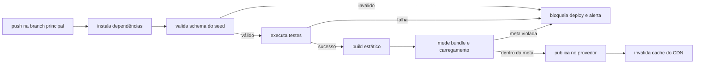

### FDD-05: Pipeline de build, validação do seed e deploy

Versão: 1.0
Data: 2026-08-06
Responsável: Alcir Junior

---

### 1. Contexto e motivação técnica

A aplicação é 100 por cento estática e depende de um pipeline confiável para três garantias: nenhum catálogo inválido chega a produção, as metas de engenharia (bundle abaixo de 150 KB gzip e carregamento do catálogo abaixo de 200 ms) são medidas a cada build e o deploy no provedor de hosting é automático e reproduzível. Esta feature cobre a validação de schema do seed `src/data/catalog.json`, a suíte de testes, a geração do bundle estático com code splitting e a publicação no provedor, com o artefato portável entre Netlify e Vercel.

Atores

- Desenvolvedor (push e pull request no repositório Git)
- Plataforma de CI/CD (execução do pipeline)
- Provedor de hosting estático (Netlify ou Vercel)
- Usuário final (recebe o resultado via CDN)

Limites de escopo

- O pipeline publica apenas artefato estático; não há provisionamento de servidores ou bancos
- A escolha definitiva entre Netlify e Vercel é decisão pendente; o artefato deve buildar e publicar em ambos
- Nenhum segredo além do token de deploy é necessário, mantido no cofre da plataforma de CI/CD

---

### 2. Objetivos técnicos

- Invariante: nenhum deploy é publicado com seed que viole o schema do catálogo; a validação bloqueia 100 por cento dos casos inválidos.
- Medir o peso do bundle inicial em cada build e falhar o pipeline quando ultrapassar 150 KB gzip.
- Medir o tempo de carregamento do catálogo em cada build e falhar o pipeline quando ultrapassar 200 ms no ambiente de CI.
- Invariante: todo build passa pela suíte completa de testes (unitários, integração da persistência e end-to-end do fluxo crítico) antes do deploy.
- Publicar automaticamente a partir da branch principal em até 5 minutos por deploy.
- Manter o artefato de build 100 por cento portável entre Netlify e Vercel, sem mudança de código.

---

### 3. Escopo e exclusões

**Incluído**

- Script de validação de schema do seed com relatório de erros por item
- Execução de testes unitários (Jest e `@testing-library/svelte`), integração da persistência (`fake-indexeddb`) e end-to-end do fluxo crítico (Playwright)
- Medição do bundle inicial e do tempo de carregamento do catálogo em CI, com bloqueio por meta
- Build estático com Vite e publicação automática no provedor de hosting
- Invalidação de cache do CDN a cada deploy e assets versionados por hash
- Alertas de falha de build e de validação para o responsável técnico

**Excluído**

- Deploys de preview por pull request com requisitos de aprovação (configuração padrão do provedor, sem customização)
- Testes de carga ou stress (não se aplicam a site estático)
- Publicação de assets de imagem por processo separado do build principal
- Monitoramento sintético externo pós-deploy
- Rollback automatizado por métricas de produção

---

### 4. Fluxos detalhados e diagramas

**Fluxo principal**

1. O desenvolvedor envia push ou merge para a branch principal do repositório.
2. O pipeline instala as dependências com lockfile imutável.
3. O script de validação verifica o schema do seed: estrutura de cada item, unicidade de IDs, enums de raridade e variação, e existência dos caminhos de imagem ou placeholders correspondentes.
4. A suíte de testes é executada: unitários, integração da persistência e end-to-end do fluxo crítico.
5. O build do Vite gera o bundle estático com code splitting por rota.
6. O pipeline mede o bundle inicial e o tempo de carregamento do catálogo, comparando com as metas de 150 KB gzip e 200 ms.
7. O artefato é publicado no provedor de hosting, que invalida o cache do CDN.
8. O pipeline registra o resultado e emite alerta em qualquer falha.

**Fluxos alternativos e exceções**

- Seed inválido: gatilho na etapa 3; resultado é falha do pipeline com relatório item a item e deploy bloqueado.
- Falha em qualquer teste: gatilho na etapa 4; resultado é deploy bloqueado com log da falha.
- Meta de engenharia violada: gatilho na etapa 6; resultado é deploy bloqueado com os valores medidos e as metas.
- Falha na publicação: gatilho na etapa 7; resultado é nova tentativa automática e, persistindo a falha, alerta ao responsável e versão anterior mantida no ar.

**Diagramas** (opcional)



---

### 5. Contratos públicos

**Script de validação do seed**

- Tipo: function
- Assinatura ou rota: `npm run validate:seed`
- Método: N/A
- Limites: execução em menos de 30 segundos para os 117 itens; entrada máxima de 1 MB de JSON
- Versionamento: o schema validado é versionado junto ao seed; mudanças de schema exigem atualização do validador no mesmo commit
- Semântica de status e headers:
  - Exit code `0`: seed válido
  - Exit code `1`: seed inválido, com relatório JSON de erros no stderr e no artefato de build

**Exemplo de requisição**

```json
{
  "command": "npm run validate:seed",
  "input": "src/data/catalog.json"
}
```

**Exemplo de resposta**

```json
{
  "valid": false,
  "errors": [
    {
      "item": "water_gold",
      "field": "rarity",
      "message": "valor fora do enum permitido"
    }
  ],
  "totalItems": 117,
  "invalidItems": 1
}
```

**Workflow de CI e deploy**

- Tipo: queue
- Assinatura ou rota: gatilhos `push` e `pull_request` na branch principal, definidos no arquivo de workflow do repositório
- Método: N/A
- Limites: deploy completo em até 5 minutos; timeout de 15 minutos por job, com cancelamento de execuções obsoletas na mesma branch
- Versionamento: pipeline definido em código no repositório, versionado junto à aplicação
- Semântica de status e headers:
  - Status `success`: todas as etapas aprovadas e artefato publicado
  - Status `failure`: etapa com falha identificada no log; deploy bloqueado
  - Concorrência: apenas o commit mais recente da branch principal segue para publicação

**Exemplo de requisição**

```json
{
  "event": "push",
  "branch": "main",
  "commit": "a1b2c3d"
}
```

**Exemplo de resposta**

```json
{
  "status": "success",
  "stages": [
    { "name": "validate_seed", "result": "success" },
    { "name": "tests", "result": "success" },
    { "name": "build", "result": "success" },
    { "name": "measure", "result": "success", "bundle_gz_kb": 132, "catalog_load_ms": 148 },
    { "name": "deploy", "result": "success", "url": "https://diario-elementais.example.com" }
  ]
}
```

---

### 6. Erros, exceções e fallback

**Matriz de erros**

| Condição                                   | Tratamento                                                  | Observações                                         |
| ------------------------------------------ | ----------------------------------------------------------- | --------------------------------------------------- |
| Timeout em job do pipeline (acima de 15 min) | Cancela o job e marca falha, com alerta ao responsável     | Evita filas presas e deploys parciais               |
| Input inválido (seed fora do schema)       | Exit code 1 com relatório de erros e deploy bloqueado       | Nenhum catálogo inválido é publicado                |
| Falha de autorização (token de deploy inválido) | Falha a etapa de publicação sem alterar a versão no ar   | Token mantido no cofre de segredos da plataforma    |
| Falha da dependência crítica (provedor indisponível) | Nova tentativa automática; persistindo, alerta e versão anterior mantida | Artefato portável permite republicar no provedor alternativo |
| Meta de engenharia violada                 | Bloqueia o deploy com valores medidos no log                | Bundle acima de 150 KB ou carregamento acima de 200 ms |

**Estratégias de resiliência**

- Timeouts: 15 minutos por job de pipeline e 5 minutos como meta de deploy completo.
- Retries: até 3 tentativas na etapa de publicação em falha transitória do provedor.
- Backoff: exponencial com jitter entre as tentativas de publicação (base de 30 segundos).
- Circuit breaker: não se aplica; falhas consecutivas de publicação interrompem o pipeline e mantêm a versão anterior no ar.

**Política de fallback**

- Qualquer falha no pipeline mantém a versão anterior publicada e funcional no CDN; nenhum deploy parcial ou inválido é exposto aos usuários. Em indisponibilidade prolongada do provedor, o mesmo artefato é republicado no provedor alternativo com apontamento de DNS.

**Invariantes**

- Nenhum commit com seed inválido, teste falho ou meta violada chega a produção.
- O artefato publicado é sempre reproduzível a partir do commit e do lockfile.
- A versão no ar nunca fica indisponível por falha de um novo deploy.

---

### 7. Observabilidade

**Métricas**

- `pipeline.duration_seconds`, histograma, dimensões: stage (validate_seed, tests, build, measure, deploy)
- `bundle.initial.gz_kb`, gauge por build, meta abaixo de 150
- `catalog.load.duration_ms`, gauge por build, meta abaixo de 200
- `pipeline.failures.total`, contador, dimensões: stage, motivo

**Logs**

- Formato: JSON estruturado na saída do pipeline, com relatório de validação anexado como artefato de build
- Campos essenciais: `commit`, `branch`, `stage`, `outcome`, `duration_ms`, `bundle_gz_kb`, `catalog_load_ms`, `error_count`
- Proteção de dados sensíveis: o token de deploy nunca aparece em logs; segredos ficam no cofre da plataforma de CI/CD, fora do repositório

**Tracing**

- Spans principais: um span por stage do pipeline (validate_seed, tests, build, measure, deploy) na visualização nativa da plataforma de CI
- Amostragem: 100 por cento das execuções, por se tratar de pipeline de baixa frequência

**Dashboards e alertas**

- Painel do pipeline com histórico de builds, duração por stage e evolução das métricas de bundle e carregamento
- Painel do provedor de hosting para deploys, disponibilidade e consumo de banda
- Alerta ao responsável técnico em falha de build, falha de validação do seed ou violação de meta de engenharia

---

### 8. Dependências e compatibilidade

| Componente              | Versão mínima | Observações                                          |
| ----------------------- | ------------- | ---------------------------------------------------- |
| Node.js                 | 20 LTS        | Ambiente de execução do pipeline                     |
| Vite                    | 5.0           | Build e empacotamento estático                       |
| SvelteKit               | 2.0           | Pré-renderização de todas as rotas                   |
| TypeScript              | 5.4           | Checagem estática no pipeline                        |
| Jest                    | 29.7          | Testes unitários                                     |
| `@testing-library/svelte` | 5.0         | Testes de componentes                                |
| `fake-indexeddb`        | 6.0           | Integração da camada de persistência                 |
| Playwright              | 1.44          | Teste end-to-end do fluxo crítico                    |
| zod                     | 3.23          | Validação de schema do seed                          |
| Provedor de hosting     | Netlify ou Vercel, plano atual | Deploy automático, CDN e TLS              |

**Garantias de compatibilidade**

- O artefato de build é portável entre Netlify e Vercel, sem mudança de código ou de configuração de rotas.
- O schema do seed evolui de forma compatível: campos novos são opcionais até nova major version do validador.
- O lockfile é imutável no pipeline, garantindo builds reproduzíveis entre ambientes.

---

### 9. Critérios de aceite técnicos

- Um seed com ID duplicado, raridade fora do enum ou campo obrigatório ausente falha a validação e bloqueia o deploy, com relatório item a item.
- Um seed válido com os 117 itens passa pela validação em menos de 30 segundos.
- O pipeline falha quando o bundle inicial medido ultrapassa 150 KB gzip ou o carregamento do catálogo ultrapassa 200 ms.
- Testes unitários, de integração da persistência e end-to-end executam e bloqueiam o deploy em qualquer falha.
- O deploy a partir da branch principal completa em até 5 minutos e invalida o cache do CDN.
- O mesmo artefato publica com sucesso em Netlify e em Vercel, sem alteração de código.
- Toda falha de pipeline gera alerta ao responsável técnico e mantém a versão anterior no ar.

---

### 10. Riscos e mitigação

#### Seed inválido ou desatualizado chega ao repositório

- **Probabilidade:** media
- **Impacto:** catálogo inconsistente publicado ou novos elementais ausentes, se a validação falhar em cobrir o caso.
- **Mitigação:**
  - Validação de schema no pipeline com falha bloqueando o deploy.
  - Tabela de referência em `docs/elementals.md` como fonte da verdade revisada a cada importação do conjunto do jogo.
- **Plano de contingência:** correção do seed seguida de novo deploy, que chega aos usuários no próximo carregamento.

#### Indisponibilidade do provedor de hosting

- **Probabilidade:** baixa
- **Impacto:** deploys bloqueados e, em falha grave, aplicação fora do ar para novos acessos.
- **Mitigação:**
  - Artefato de build 100 por cento portável entre Netlify e Vercel.
  - Uso do CDN multi-região do provedor, com cache de edge absorvendo parte das falhas de origem.
- **Plano de contingência:** republicar o mesmo artefato estático no provedor alternativo e apontar o DNS, sem mudança de código.

#### Token de deploy exposto ou inválido

- **Probabilidade:** baixa
- **Impacto:** deploys bloqueados ou publicação por agente não autorizado.
- **Mitigação:**
  - Token mantido exclusivamente no cofre de segredos da plataforma de CI/CD, fora do repositório.
  - Escopo mínimo de permissão no provedor e rotação periódica.
- **Plano de contingência:** revogar o token comprometido, emitir novo token no cofre e reexecutar o pipeline.

#### Metas de engenharia degradam gradualmente sem bloqueio

- **Probabilidade:** media
- **Impacto:** bundle e tempo de carregamento crescem até afetar usuários móveis.
- **Mitigação:**
  - Medição de bundle e de carregamento em cada build, com bloqueio por meta.
  - Histórico das métricas no painel do pipeline para detectar tendência antes do bloqueio.
- **Plano de contingência:** auditoria de dependências e code splitting adicional, seguidos de novo deploy.
